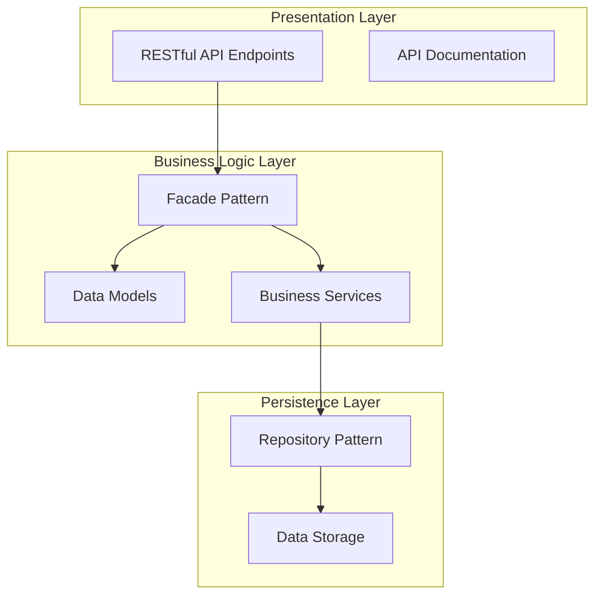

# HBnB Evolution Project 🏠

A comprehensive **AirBnB clone** application developed as part of the Holberton School curriculum. This project demonstrates the complete software development lifecycle from architectural design to implementation, featuring a modern **three-layer architecture** with RESTful APIs, object-oriented programming, and scalable design patterns.

## 🌟 Project Overview

**Repository:** `holbertonschool-hbnb`  
**School:** Holberton School  
**Track:** Backend Web Development  
**Architecture:** Three-Layer Architecture with Facade Pattern  
**Framework:** Flask + Flask-RESTx  
**Status:** Complete Multi-Part Implementation (Parts 1-4: Design → Backend → Database → Full-Stack)

## 🎯 Project Objectives

This project creates a simplified AirBnB application that allows users to:

- 👤 **User Management**: Registration, authentication, profile management, and role-based access
- 🏘️ **Place Management**: Property listings with detailed metadata and amenity associations  
- ⭐ **Review System**: User ratings and comments for places with validation
- 🛠️ **Amenity Management**: Create, update, and manage property amenities
- 💾 **Data Persistence**: Scalable storage architecture (in-memory → database)

## 🏗️ Architecture & Design

### Three-Layer Architecture



### Core Design Patterns

- **🎭 Facade Pattern**: Simplifies communication between layers
- **📦 Repository Pattern**: Abstracts data access and storage
- **🏭 Factory Pattern**: Creates and manages object instances
- **🔧 Dependency Injection**: Loose coupling between components

## 📁 Project Structure

```
holbertonschool-hbnb/
├── 📋 README.md                     # This comprehensive guide
├── 📊 part1/                        # Architecture & Design Phase
│   ├── 📖 README.md                 # Technical documentation
│   └── 📈 DIAGRAMASFINAL/           # UML diagrams and visuals
│       ├── class_diagram.png
│       ├── sequence_diagrams.png
│       └── architecture_overview.png
└── 🚀 part2/                        # Implementation Phase
    ├── 📖 README.md                 # Implementation documentation
    ├── ⚙️ config.py                 # Application configuration
    ├── 📦 requirements.txt          # Python dependencies
    ├── 🎯 run.py                    # Application entry point
    ├── 📝 server.log                # Server logs
    ├── 🔧 app/                      # Main application package
    │   ├── 🌐 api/v1/               # Presentation Layer (REST API)
    │   │   ├── users.py             # User management endpoints
    │   │   ├── places.py            # Place management endpoints
    │   │   ├── reviews.py           # Review management endpoints
    │   │   └── amenities.py         # Amenity management endpoints
    │   ├── 📊 models/               # Business Logic Layer (Data Models)
    │   │   ├── base_model.py        # Abstract base class
    │   │   ├── user.py              # User entity model
    │   │   ├── place.py             # Place entity model
    │   │   ├── review.py            # Review entity model
    │   │   └── amenity.py           # Amenity entity model
    │   ├── 🎯 services/             # Business Logic Layer (Services)
    │   │   └── facade.py            # Facade pattern implementation
    │   └── 💾 persistence/          # Persistence Layer (Data Access)
    │       └── repository.py        # In-memory repository
    ├── 🧪 tests/                    # Comprehensive test suite
    │   ├── test_user_endpoints.py   # User API tests
    │   ├── test_amenity_creation.py # Amenity tests
    │   ├── test_put_endpoint.py     # Update operation tests
    │   └── example_*.py             # Usage examples
    └── 🐍 venv/                     # Python virtual environment
```

## 🔧 Technical Stack

### Backend Technologies
- **🐍 Python 3.8+**: Core programming language
- **🌶️ Flask**: Lightweight web framework
- **📝 Flask-RESTx**: RESTful API development with auto-documentation
- **🏗️ Object-Oriented Programming**: Clean architecture with inheritance

### Development Tools
- **🧪 Unit Testing**: Comprehensive test coverage
- **📚 Auto-Documentation**: Swagger/OpenAPI integration
- **🔧 Virtual Environment**: Isolated dependency management
- **📊 Logging**: Application monitoring and debugging

### Architecture Patterns
- **🏛️ Three-Layer Architecture**: Separation of concerns
- **🎭 Facade Pattern**: Simplified layer communication  
- **📦 Repository Pattern**: Abstract data access
- **🔄 RESTful Design**: Standard HTTP methods and status codes

## 🚀 Getting Started

### Prerequisites
- Python 3.8 or higher
- pip (Python package manager)
- Git for version control

### Installation & Setup

1. **Clone the Repository**
```bash
git clone https://github.com/holbertonschool/holbertonschool-hbnb.git
cd holbertonschool-hbnb/part2
```

2. **Create Virtual Environment**
```bash
python3 -m venv venv
source venv/bin/activate  # On Windows: venv\Scripts\activate
```

3. **Install Dependencies**
```bash
pip install -r requirements.txt
```

4. **Run the Application**
```bash
python run.py
```

5. **Access the API**
- **Application**: http://localhost:5001
- **API Documentation**: http://localhost:5001/api/v1/
- **Interactive Docs**: Swagger UI available at the docs endpoint

## 📡 API Endpoints

### 👤 User Management
```http
POST   /api/v1/users           # Create new user
GET    /api/v1/users           # List all users  
GET    /api/v1/users/{id}      # Get specific user
PUT    /api/v1/users/{id}      # Update user
DELETE /api/v1/users/{id}      # Delete user
```

### 🏘️ Place Management
```http
POST   /api/v1/places          # Create new place
GET    /api/v1/places          # List all places
GET    /api/v1/places/{id}     # Get specific place  
PUT    /api/v1/places/{id}     # Update place
DELETE /api/v1/places/{id}     # Delete place
```

### ⭐ Review Management
```http
POST   /api/v1/reviews         # Create new review
GET    /api/v1/reviews         # List all reviews
GET    /api/v1/reviews/{id}    # Get specific review
PUT    /api/v1/reviews/{id}    # Update review
DELETE /api/v1/reviews/{id}    # Delete review
```

### 🛠️ Amenity Management
```http
POST   /api/v1/amenities       # Create new amenity
GET    /api/v1/amenities       # List all amenities
GET    /api/v1/amenities/{id}  # Get specific amenity
PUT    /api/v1/amenities/{id}  # Update amenity
DELETE /api/v1/amenities/{id}  # Delete amenity
```

## 🧪 Testing

### Running Tests
```bash
# Run all tests
python -m pytest tests/

# Run specific test file
python -m pytest tests/test_user_endpoints.py

# Run with verbose output
python -m pytest -v tests/

# Run with coverage report
python -m pytest --cov=app tests/
```

### Test Examples
```bash
# Test user creation
python tests/test_user_endpoints.py

# Test amenity management
python tests/test_amenity_creation.py

# Test update operations
python tests/test_put_endpoint.py
```

## 📊 Data Models

### 👤 User Model
```python
{
    "id": "string (UUID)",
    "first_name": "string",
    "last_name": "string", 
    "email": "string (unique)",
    "password": "string (hashed)",
    "is_admin": "boolean",
    "created_at": "datetime",
    "updated_at": "datetime"
}
```

### 🏘️ Place Model
```python
{
    "id": "string (UUID)",
    "title": "string",
    "description": "string",
    "price": "float",
    "latitude": "float",
    "longitude": "float", 
    "owner_id": "string (User UUID)",
    "amenity_ids": ["string (Amenity UUIDs)"],
    "created_at": "datetime",
    "updated_at": "datetime"
}
```

### ⭐ Review Model
```python
{
    "id": "string (UUID)",
    "place_id": "string (Place UUID)",
    "user_id": "string (User UUID)",
    "rating": "integer (1-5)",
    "comment": "string",
    "created_at": "datetime",
    "updated_at": "datetime"
}
```

### 🛠️ Amenity Model
```python
{
    "id": "string (UUID)",
    "name": "string (unique)",
    "description": "string",
    "created_at": "datetime", 
    "updated_at": "datetime"
}
```

## 🎯 Business Logic & Validation

### Data Validation Rules
- **Email Format**: Valid email address format required
- **Password Security**: Minimum length and complexity requirements
- **Rating Range**: Reviews must be between 1-5 stars
- **Coordinates**: Latitude/longitude within valid geographic ranges
- **Unique Constraints**: Email addresses and amenity names must be unique
- **Required Fields**: All mandatory fields must be provided

### Business Rules
- **User Authentication**: Secure user registration and login
- **Ownership Validation**: Users can only modify their own content
- **Review Restrictions**: Users cannot review their own places
- **Admin Privileges**: Special permissions for administrative users
- **Data Integrity**: Referential integrity between related entities

## 🔮 Future Enhancements (Part 3+)

### Database Integration
- **🗄️ SQLAlchemy ORM**: Replace in-memory storage
- **🐘 PostgreSQL**: Production-ready database
- **📊 Database Migrations**: Version-controlled schema changes
- **🔍 Query Optimization**: Efficient data retrieval

### Advanced Features
- **🔐 JWT Authentication**: Secure token-based auth
- **📤 File Upload**: Image handling for places
- **🔍 Advanced Search**: Filter and search functionality
- **📧 Email Notifications**: User communication system
- **📱 Mobile API**: Mobile app support

### DevOps & Deployment
- **🐳 Docker**: Containerized deployment
- **☁️ Cloud Deployment**: AWS/GCP/Azure integration
- **🔄 CI/CD Pipeline**: Automated testing and deployment
- **📊 Monitoring**: Application performance monitoring

## 🎓 Learning Outcomes

### Software Architecture
- **🏗️ Layered Architecture**: Understanding separation of concerns
- **🎭 Design Patterns**: Practical application of common patterns
- **📡 RESTful APIs**: Standard web service design
- **🔧 Modular Design**: Creating maintainable and scalable code

### Backend Development
- **🐍 Python Mastery**: Advanced Python programming concepts
- **🌶️ Flask Expertise**: Web framework proficiency
- **🗄️ Data Modeling**: Entity relationship design
- **🧪 Testing Strategy**: Comprehensive testing methodologies

### Software Engineering
- **📚 Documentation**: Clear technical documentation
- **🔄 Version Control**: Git workflow and collaboration
- **🎯 Project Structure**: Organizing large-scale applications
- **🚀 Deployment**: Application lifecycle management

## 📚 Resources & References

### Documentation
- [Flask Official Documentation](https://flask.palletsprojects.com/)
- [Flask-RESTx Documentation](https://flask-restx.readthedocs.io/)
- [Python Design Patterns](https://python-patterns.guide/)
- [RESTful API Design Guidelines](https://restfulapi.net/)

### Learning Materials
- [Three-Layer Architecture](https://www.oreilly.com/library/view/software-architecture-patterns/9781491971437/ch01.html)
- [Facade Pattern Tutorial](https://refactoring.guru/design-patterns/facade)
- [Repository Pattern in Python](https://breadcrumbscollector.tech/repository-pattern-in-python/)
- [Flask Best Practices](https://flask.palletsprojects.com/en/stable/patterns/)

## 🤝 Contributing

This repository represents academic work completed as part of the Holberton School curriculum. The project follows a structured learning approach with specific phases:

### Development Phases
1. **📋 Part 1**: Architecture design and documentation
2. **🚀 Part 2**: Core implementation with in-memory storage  
3. **🗄️ Part 3**: Database integration and persistence
4. **🔒 Part 4**: Authentication and advanced features

### Code Standards
- **PEP 8**: Python code style compliance
- **Documentation**: Comprehensive docstrings and comments
- **Testing**: Unit test coverage for all components
- **Git Flow**: Structured branching and commit messages

## 📧 Project Information

**Institution**: Holberton School  
**Program**: Full-Stack Software Engineering  
**Project Type**: Backend Web Development  
**Duration**: Multi-part implementation  
**Technologies**: Python, Flask, RESTful APIs, OOP

---

*This project demonstrates the progression from architectural design to full-stack implementation, showcasing modern software engineering practices and design patterns in a real-world application context.*
