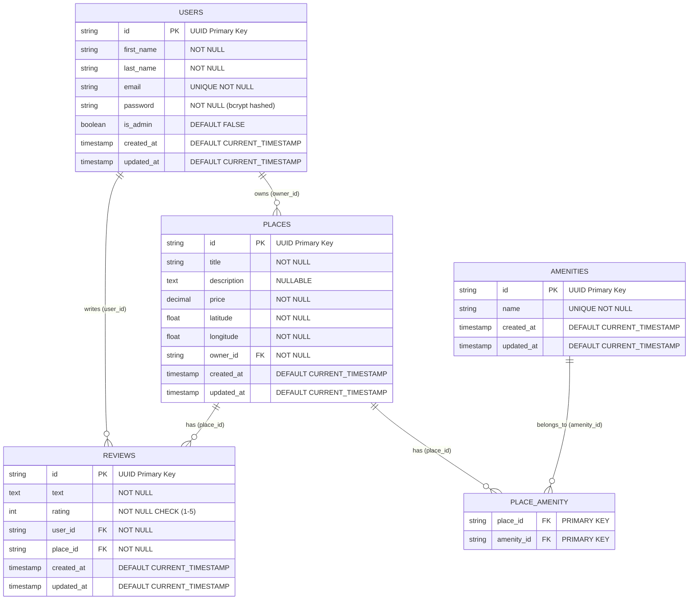
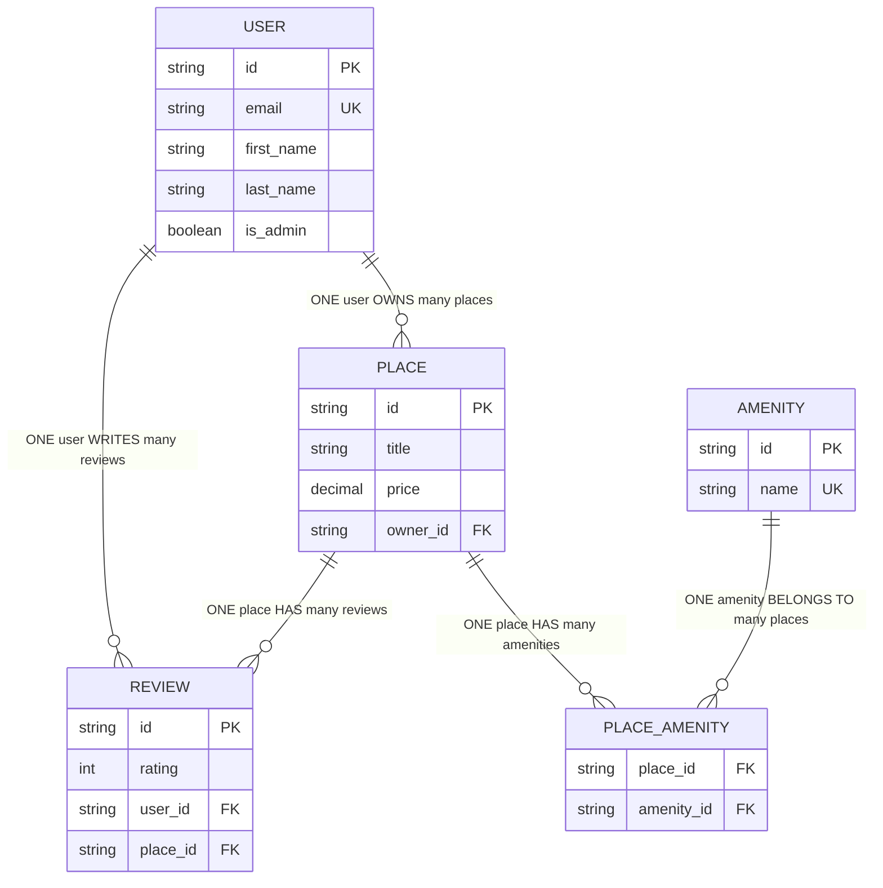

# HBnB Evolution - Part 3: Persistence and Advanced Features

## Author

- **Hector Soto**

## 📖 Overview

Part 3 of the HBnB Evolution project introduces advanced persistence capabilities, authentication, and business logic validation. This iteration builds upon the foundation established in Parts 1 and 2, implementing SQLAlchemy ORM, JWT authentication, password hashing, and comprehensive API endpoints.

## 🏗️ Architecture

### Project Structure
```
part3/
├── app/
│   ├── __init__.py                 # Flask app factory with extensions
│   ├── models/                     # Data models
│   │   ├── __init__.py
│   │   ├── base_model.py           # Base model with common fields
│   │   ├── user.py                 # User entity
│   │   ├── place.py                # Place entity  
│   │   ├── amenity.py              # Amenity entity
│   │   └── review.py               # Review entity
│   ├── api/
│   │   ├── __init__.py
│   │   └── v1/
│   │       ├── __init__.py         # API blueprint registration
│   │       ├── auth.py             # Authentication endpoints
│   │       ├── users.py            # User management endpoints
│   │       ├── places.py           # Place management endpoints
│   │       ├── amenities.py        # Amenity management endpoints
│   │       ├── reviews.py          # Review management endpoints
│   │       └── protected.py        # Protected route examples
│   ├── services/
│   │   ├── __init__.py
│   │   ├── facade.py               # In-memory business logic
│   │   ├── facade_db.py            # Database-ready facade
│   │   ├── facade_sqlalchemy.py    # Complete SQLAlchemy facade
│   │   └── repositories/
│   │       ├── __init__.py
│   │       └── user_repository.py  # User-specific database operations
│   └── persistence/
│       ├── __init__.py
│       └── repository.py           # Repository pattern implementation
├── documentations/                 # Project documentation
│   ├── ADMIN_ENDPOINTS_GUIDE.md           # Admin endpoints usage guide
│   ├── APPLICATION_FACTORY_COMPLETED.md   # Application factory pattern guide
│   ├── JWT_AUTHENTICATION_COMPLETED.md    # JWT authentication implementation
│   ├── PASSWORD_HASHING_COMPLETED.md      # Password hashing with bcrypt
│   ├── RELATIONSHIPS_DOCUMENTATION.md     # Database relationships guide
│   ├── SQLALCHEMY_INTEGRATION.md          # SQLAlchemy integration details
│   └── USER_MODEL_MAPPING.md              # User model and database mapping
├── database_diagrams/              # Database ER diagrams (Mermaid.js)
│   ├── hbnb_er_diagram.md          # Core database schema
│   ├── hbnb_extended_er_diagram.md # Extended schema with booking system
│   ├── relationship_types_diagram.md # Educational relationship diagrams
│   ├── diagram_examples.md         # Examples and exercises
│   ├── view_diagrams.sh            # Safe diagram viewer script
│   └── README.md                   # Diagram documentation
├── sql_scripts/                    # SQL table generation scripts
│   ├── 00_execute_all.sql          # Master script to execute all SQL files
│   ├── 01_create_tables.sql        # Database schema creation
│   ├── 02_insert_initial_data.sql  # Initial data insertion
│   ├── 03_test_crud_operations.sql # CRUD operations testing
│   ├── generate_uuids.py           # UUID generation utility
│   ├── test_sql_scripts.py         # Test validation for SQL scripts
│   ├── README.md                   # SQL scripts documentation
│   └── SQL_SCRIPTS_DOCUMENTATION.md # Comprehensive SQL documentation
├── tests/                          # Test files and examples
│   ├── test_*.py                   # Various test modules
│   └── example_*.py                # Example usage scripts
├── config.py                       # Application configuration
├── run.py                          # Application entry point
├── requirements.txt                # Python dependencies
├── BCRYPT_USAGE.md                # Password hashing guide
├── SQLALCHEMY_IMPLEMENTATION_SUMMARY.md  # Database implementation details
└── README.md                       # This file
```

## 🚀 Features

### Authentication & Security
- **JWT Token Authentication**: Secure API access with JSON Web Tokens
- **Password Hashing**: Bcrypt integration for secure password storage
- **Role-Based Access Control**: Admin and regular user permissions
- **Protected Routes**: JWT-required endpoints

### Data Models
- **User Management**: Registration, authentication, profile management
- **Place Management**: Property listings with owner relationships
- **Amenity System**: Reusable amenities for places
- **Review System**: User reviews for places with rating validation

### Persistence Options
- **In-Memory Storage**: Fast development and testing
- **SQLAlchemy ORM**: Production-ready database persistence
- **Repository Pattern**: Flexible data access layer
- **Multiple Facade Implementations**: Seamless switching between storage types

### API Features
- **RESTful Design**: Standard HTTP methods and status codes
- **OpenAPI Documentation**: Auto-generated API docs with Flask-RESTX
- **Request Validation**: Input validation and sanitization
- **Error Handling**: Comprehensive error responses
- **CORS Support**: Cross-origin resource sharing

## 🛠️ Technology Stack

### Core Framework
- **Flask**: Web framework
- **Flask-RESTX**: REST API with Swagger documentation
- **SQLAlchemy**: ORM for database operations
- **Flask-SQLAlchemy**: Flask integration for SQLAlchemy

### Security
- **Flask-JWT-Extended**: JWT token management
- **Flask-Bcrypt**: Password hashing
- **UUID**: Unique identifier generation

### Development Tools
- **pycodestyle**: Code style enforcement
- **pytest**: Testing framework (tests included)

## 📦 Installation

### Prerequisites
- Python 3.8+
- pip package manager

### Setup
1. **Clone and Navigate**:
   ```bash
   cd part3
   ```

2. **Create Virtual Environment**:
   ```bash
   python3 -m venv venv
   source venv/bin/activate  # On Windows: venv\Scripts\activate
   ```

3. **Install Dependencies**:
   ```bash
   pip install -r requirements.txt
   ```

4. **Environment Configuration** (Optional):
   ```bash
   export SECRET_KEY="your-secret-key"
   export JWT_SECRET_KEY="your-jwt-secret"
   ```

## 🏃‍♂️ Running the Application

### Development Server
```bash
python run.py
```
The application will start on `http://localhost:5001`

### API Documentation
Access the interactive API documentation at:
- **Swagger UI**: `http://localhost:5001/`
- **API Endpoints**: `http://localhost:5001/api/v1/`

## ER Diagram

The `hbnb.er` file contains the Entity-Relationship diagram definitions for the project, capturing the structure of database entities and their relationships:

```plaintext
[User]
*id {label: "varchar, primary key"}
first_name {label: "varchar"}
last_name {label: "varchar"}
email {label: "varchar, unique"}
password {label: "varchar"}
is_admin {label: "boolean"}

[Place]
*id {label: "varchar, primary key"}
title {label: "varchar"}
description {label: "text"}
price {label: "decimal"}
latitude {label: "decimal"}
longitude {label: "decimal"}
+owner_id {label: "varchar, foreign key"}

[Review]
*id {label: "varchar, primary key"}
text {label: "text"}
rating {label: "integer"}
+user_id {label: "varchar, foreign key"}
+place_id {label: "varchar, foreign key"}

[Amenity]
*id {label: "varchar, primary key"}
name {label: "varchar"}

[Place_Amenity]
*+place_id {label: "varchar, foreign key"}
*+amenity_id {label: "varchar, foreign key"}

[Reservation]
*id {label: "varchar, primary key"}
check_in_date {label: "date"}
check_out_date {label: "date"}
total_guests {label: "integer"}
total_price {label: "decimal"}
status {label: "varchar"}
created_at {label: "datetime"}
updated_at {label: "datetime"}
+user_id {label: "varchar, foreign key"}
+place_id {label: "varchar, foreign key"}

[Payment]
*id {label: "varchar, primary key"}
amount {label: "decimal"}
payment_method {label: "varchar"}
payment_status {label: "varchar"}
transaction_id {label: "varchar"}
payment_date {label: "datetime"}
+reservation_id {label: "varchar, foreign key"}

[Message]
*id {label: "varchar, primary key"}
content {label: "text"}
sent_at {label: "datetime"}
is_read {label: "boolean"}
+sender_id {label: "varchar, foreign key"}
+receiver_id {label: "varchar, foreign key"}
+reservation_id {label: "varchar, foreign key"}

# Relationships
User ||--o{ Place
User ||--o{ Review
User ||--o{ Reservation
User ||--o{ Message
Place ||--o{ Review
Place ||--o{ Reservation
Place }o--o{ Amenity
Reservation ||--|| Payment
Reservation ||--o{ Message
```

To create a visual diagram from this definition, run:
```bash
erd hbnb.er -o hbnb.png
```

### Generated Diagram

The visual representation of the database schema:


*Figure: Entity-Relationship Diagram showing the complete database schema with entities, attributes, and relationships.*

## 📊 Database Diagrams

Comprehensive database diagrams are available in the `database_diagrams/` directory, created using Mermaid.js for better visualization and documentation.

### Core Database Schema



### Relationship Types



### Database Design Principles

#### Relationships Implemented
- **One-to-Many**: User → Places, User → Reviews, Place → Reviews
- **Many-to-Many**: Place ↔ Amenity (via PLACE_AMENITY junction table)
- **Foreign Keys**: All relationships include proper constraints
- **Business Rules**: All domain rules enforced at database level

#### Constraints
- **Primary Keys**: UUID format for all entities
- **Foreign Keys**: Referential integrity with CASCADE DELETE
- **Unique Constraints**: Email addresses, amenity names, user-place reviews
- **Check Constraints**: Rating validation (1-5 stars)
- **NOT NULL**: Required fields enforced

#### Data Integrity
- **UUID Primary Keys**: Consistent across all entities
- **Timestamp Tracking**: Automatic created_at and updated_at
- **Password Security**: Bcrypt hashing with salt
- **Business Logic**: Users cannot review their own places

### Additional Diagrams

For more detailed diagrams and examples, see the `database_diagrams/` directory:

- **[Main ER Diagram](./database_diagrams/hbnb_er_diagram.md)** - Complete core database schema
- **[Extended Schema](./database_diagrams/hbnb_extended_er_diagram.md)** - Future booking system entities
- **[Relationship Types](./database_diagrams/relationship_types_diagram.md)** - Educational relationship explanations
- **[Examples](./database_diagrams/diagram_examples.md)** - Practical examples and exercises
- **[Documentation](./database_diagrams/README.md)** - Complete diagram usage guide

### Viewing the Diagrams

1. **GitHub/GitLab**: View `.md` files directly - they render automatically
2. **Mermaid Live Editor**: Copy diagram code to https://mermaid.live/
3. **VS Code**: Install Mermaid extension and use preview mode
4. **Safe Viewer**: Run `./database_diagrams/view_diagrams.sh` for guided viewing

## 📡 API Endpoints

### Authentication
- `POST /api/v1/auth/login` - User authentication
- `POST /api/v1/auth/protected` - Protected route example

### User Management
- `GET /api/v1/users/` - List all users
- `POST /api/v1/users/` - Create new user (admin only after first user)
- `GET /api/v1/users/{id}` - Get user details
- `PUT /api/v1/users/{id}` - Update user (admin only)

### Place Management
- `GET /api/v1/places/` - List all places
- `POST /api/v1/places/` - Create new place (authenticated)
- `GET /api/v1/places/{id}` - Get place details
- `PUT /api/v1/places/{id}` - Update place (owner or admin)

### Amenity Management
- `GET /api/v1/amenities/` - List all amenities
- `POST /api/v1/amenities/` - Create amenity (admin only)
- `GET /api/v1/amenities/{id}` - Get amenity details
- `PUT /api/v1/amenities/{id}` - Update amenity (admin only)

### Review Management
- `GET /api/v1/reviews/` - List all reviews
- `POST /api/v1/reviews/` - Create review (authenticated)
- `GET /api/v1/reviews/{id}` - Get review details
- `PUT /api/v1/reviews/{id}` - Update review (author or admin)
- `DELETE /api/v1/reviews/{id}` - Delete review (author or admin)

## 🗄️ Database Configuration

### SQLite (Development)
The application uses SQLite by default:
```python
SQLALCHEMY_DATABASE_URI = 'sqlite:///development.db'
```

### Database Initialization
```bash
python init_db.py  # Initialize database schema
```

### SQL Scripts
The `sql_scripts/` directory contains comprehensive SQL scripts for database setup and testing:

#### Available Scripts
- **`00_execute_all.sql`** - Master script that executes all SQL files in order
- **`01_create_tables.sql`** - Creates all database tables with proper constraints
- **`02_insert_initial_data.sql`** - Inserts initial test data for development
- **`03_test_crud_operations.sql`** - Tests all CRUD operations on the database
- **`generate_uuids.py`** - Python utility to generate UUID values for SQL scripts
- **`test_sql_scripts.py`** - Validation tests for SQL script functionality

#### Using SQL Scripts
```bash
# Execute all SQL scripts in order
mysql -u username -p database_name < sql_scripts/00_execute_all.sql

# Or execute individual scripts
mysql -u username -p database_name < sql_scripts/01_create_tables.sql
mysql -u username -p database_name < sql_scripts/02_insert_initial_data.sql

# Generate UUIDs for testing
python sql_scripts/generate_uuids.py

# Test SQL scripts functionality
python sql_scripts/test_sql_scripts.py
```

### Repository Pattern
The application implements a flexible repository pattern supporting both in-memory and database storage:

```python
# In-memory repository
from app.services.facade import facade

# SQLAlchemy repository  
from app.services.facade_sqlalchemy import facade
```

## 🔐 Authentication Flow

### First User (Auto-Admin)
The first user created automatically becomes an admin:
```bash
curl -X POST "http://localhost:5001/api/v1/users/" \
  -H "Content-Type: application/json" \
  -d '{"first_name": "Admin", "last_name": "User", "email": "admin@example.com", "password": "admin123"}'
```

### User Login
```bash
curl -X POST "http://localhost:5001/api/v1/auth/login" \
  -H "Content-Type: application/json" \
  -d '{"email": "admin@example.com", "password": "admin123"}'
```

### Using JWT Token
```bash
curl -X GET "http://localhost:5001/api/v1/auth/protected" \
  -H "Authorization: Bearer YOUR_JWT_TOKEN"
```

## 🧪 Testing

### Running Tests
```bash
# Run all tests
python -m pytest tests/

# Run specific test file
python tests/test_user_endpoints.py

# Run with verbose output
python -m pytest tests/ -v
```

### Example Test Scripts
- `tests/test_user_endpoints.py` - User API testing
- `tests/test_amenity_creation.py` - Amenity management testing
- `tests/test_reviews_api.py` - Review system testing
- `tests/test_models.py` - Model validation testing

### Manual Testing Examples
```bash
# Test user creation
python tests/example_user_creation.py

# Test review system
python tests/example_review_api.py

# Test place registration
python tests/test_place_registration.py
```

## 🔍 Code Quality

### Style Guidelines
The project follows PEP 8 style guidelines:
```bash
# Check code style
pycodestyle app/

# Auto-format code (if autopep8 is installed)
autopep8 --in-place --recursive app/
```

## 🏢 Business Logic

### User Management
- **Admin Privileges**: First user becomes admin automatically
- **Email Uniqueness**: Enforced across the system
- **Password Security**: Bcrypt hashing with salt

### Place Management
- **Owner Relationships**: Users can own multiple places
- **Amenity Associations**: Many-to-many relationship with amenities
- **Validation**: Price, location, and description validation

### Review System
- **User Restrictions**: Users cannot review their own places
- **One Review Per Place**: One review per user per place
- **Rating Validation**: 1-5 star rating system
- **Author Permissions**: Only authors and admins can modify reviews

### Data Integrity
- **UUID Primary Keys**: Consistent across all entities
- **Timestamp Tracking**: Created and updated timestamps
- **Referential Integrity**: Foreign key constraints and validations

## 📚 Documentation

Comprehensive documentation is available in the `documentations/` directory. Below is the complete documentation content:

### Core Documentation
- **[Admin Endpoints Guide](./documentations/ADMIN_ENDPOINTS_GUIDE.md)** - Complete guide to admin-only endpoints and permissions
- **[Application Factory Pattern](./documentations/APPLICATION_FACTORY_COMPLETED.md)** - Flask application factory implementation guide
- **[JWT Authentication](./documentations/JWT_AUTHENTICATION_COMPLETED.md)** - JWT token authentication implementation details
- **[Password Hashing](./documentations/PASSWORD_HASHING_COMPLETED.md)** - Bcrypt password hashing implementation
- **[Database Relationships](./documentations/RELATIONSHIPS_DOCUMENTATION.md)** - Complete database relationships documentation
- **[SQLAlchemy Integration](./documentations/SQLALCHEMY_INTEGRATION.md)** - SQLAlchemy ORM integration guide
- **[User Model Mapping](./documentations/USER_MODEL_MAPPING.md)** - User model and database mapping details

### SQL Scripts Documentation
- **[SQL Scripts Guide](./sql_scripts/README.md)** - How to use the SQL scripts for database setup
- **[Comprehensive SQL Documentation](./sql_scripts/SQL_SCRIPTS_DOCUMENTATION.md)** - Detailed SQL implementation guide

### Database Diagrams
- **[Database Diagrams Guide](./database_diagrams/README.md)** - Complete guide to viewing and understanding database diagrams
- **[Core ER Diagram](./database_diagrams/hbnb_er_diagram.md)** - Main database schema diagram
- **[Extended ER Diagram](./database_diagrams/hbnb_extended_er_diagram.md)** - Future features database schema
- **[Relationship Types](./database_diagrams/relationship_types_diagram.md)** - Educational relationship diagrams

---

## 📋 Admin Endpoints Guide

### Overview
Administrators have the highest level of privileges in the system and can:
- Create and modify user accounts
- Add and modify amenities
- Bypass ownership restrictions for places and reviews
- Perform all actions that regular users can do

### Admin-Only Endpoints
1. **POST /api/v1/users/** - Create a new user
2. **PUT /api/v1/users/<user_id>** - Modify any user's details
3. **POST /api/v1/amenities/** - Add a new amenity
4. **PUT /api/v1/amenities/<amenity_id>** - Modify amenity details

### Admin Bypass Capabilities
Administrators can bypass ownership restrictions on:
- **PUT /api/v1/places/<place_id>** - Modify any place (not just owned ones)
- **PUT /api/v1/reviews/<review_id>** - Modify any review (not just authored ones)
- **DELETE /api/v1/reviews/<review_id>** - Delete any review (not just authored ones)

### Getting Admin Token
```bash
curl -X POST "http://127.0.0.1:5000/api/v1/auth/login" \
  -H "Content-Type: application/json" \
  -d '{"email": "admin@example.com", "password": "adminpass123"}'
```

### Creating New User (Admin Only)
```bash
curl -X POST "http://127.0.0.1:5000/api/v1/users/" \
  -H "Authorization: Bearer <admin_token>" \
  -H "Content-Type: application/json" \
  -d '{
    "first_name": "New",
    "last_name": "User",
    "email": "newuser@example.com",
    "password": "newpass123",
    "is_admin": false
  }'
```

### Error Responses
- **401 - Authentication Required**: `{"msg": "Missing Authorization Header"}`
- **403 - Admin Privileges Required**: `{"error": "Admin privileges required"}`
- **403 - Unauthorized Action**: `{"error": "Unauthorized action"}`
- **400 - Email Already Registered**: `{"error": "Email already registered"}`
- **404 - Resource Not Found**: `{"error": "User not found"}`

---

## 🏭 Application Factory Pattern

### Overview
The Flask Application Factory pattern provides flexible configuration management for different environments (development, production, testing).

### Configuration Classes
- **Config**: Base configuration class with common settings
- **DevelopmentConfig**: Development-specific settings (DEBUG=True)
- **ProductionConfig**: Production-specific settings (DEBUG=False)
- **TestingConfig**: Testing-specific settings (DEBUG=True, TESTING=True)

### Implementation
```python
# app/__init__.py
def create_app(config_class="config.DevelopmentConfig"):
    app = Flask(__name__)
    app.config.from_object(config_class)
    # ... rest of the application setup
    return app

# config.py
class Config:
    SECRET_KEY = os.getenv('SECRET_KEY', 'default_secret_key')
    DEBUG = False
    TESTING = False

class DevelopmentConfig(Config):
    DEBUG = True
    DEVELOPMENT = True

class ProductionConfig(Config):
    DEBUG = False
    TESTING = False

class TestingConfig(Config):
    DEBUG = True
    TESTING = True
```

### Usage Examples
```python
# Default configuration (Development)
app = create_app()

# Explicit configuration
app = create_app(config_class="config.ProductionConfig")

# Using class object
from config import ProductionConfig
app = create_app(config_class=ProductionConfig)
```

### Key Features
1. **Backward Compatibility**: Existing code continues to work without changes
2. **Flexible Configuration**: Supports multiple ways to specify configuration
3. **Environment Support**: Easy switching between development, production, and testing
4. **Default Behavior**: Sensible default (DevelopmentConfig) when no config specified
5. **Extensible**: Easy to add new configuration types as needed

---

## 🔐 JWT Authentication Implementation

### Overview
JWT-based authentication provides secure login functionality and protected endpoints using flask-jwt-extended.

### Authentication Flow
1. **User Login**: POST /api/v1/auth/login
2. **Token Generation**: JWT token with user ID and admin status
3. **Protected Access**: Use token in Authorization header

### Implementation
```python
# app/__init__.py
from flask_jwt_extended import JWTManager

jwt = JWTManager()

def create_app(config_class="config.DevelopmentConfig"):
    app = Flask(__name__)
    app.config.from_object(config_class)
    
    # Initialize JWT
    jwt.init_app(app)
    
    # JWT error handlers
    @jwt.unauthorized_loader
    def unauthorized_callback(callback):
        return {'error': 'Missing Authorization Header'}, 401
    
    @jwt.invalid_token_loader
    def invalid_token_callback(callback):
        return {'error': 'Invalid token'}, 401
    
    @jwt.expired_token_loader
    def expired_token_callback(jwt_header, jwt_payload):
        return {'error': 'Token has expired'}, 401

# app/api/v1/auth.py
from flask_jwt_extended import create_access_token

@api.route('/login')
class Login(Resource):
    @api.expect(login_model)
    def post(self):
        credentials = api.payload
        
        # Retrieve user by email
        user = facade.get_user_by_email(credentials['email'])
        
        # Verify credentials
        if not user or not user.verify_password(credentials['password']):
            return {'error': 'Invalid credentials'}, 401
        
        # Create JWT token
        access_token = create_access_token(
            identity=str(user.id),
            additional_claims={'is_admin': user.is_admin}
        )
        
        return {'access_token': access_token}, 200
```

### Using JWT Tokens
```bash
# Login
curl -X POST "http://127.0.0.1:5000/api/v1/auth/login" \
  -H "Content-Type: application/json" \
  -d '{"email": "john.doe@example.com", "password": "password123"}'

# Access protected endpoint
curl -X GET "http://127.0.0.1:5000/api/v1/protected" \
  -H "Authorization: Bearer <jwt_token>"
```

### Token Structure
```json
{
  "sub": "12345678-1234-1234-1234-123456789012",
  "iat": 1639123456,
  "exp": 1639127056,
  "is_admin": false
}
```

### Security Features
1. **Token-Based Authentication**: Stateless, scalable authentication
2. **Role-Based Access Control**: Admin status embedded in token
3. **Comprehensive Error Handling**: Clear error messages for all failure scenarios
4. **Secure Password Verification**: Integrates with bcrypt implementation
5. **Token Expiration**: Automatic token expiration (configurable)

---

## 🔒 Password Hashing Implementation

### Overview
Secure password hashing using bcrypt for the User model, ensuring passwords are never stored in plaintext.

### Implementation
```python
# app/models/user.py
def hash_password(self, password):
    """Hashes the password before storing it."""
    from flask_bcrypt import Bcrypt
    bcrypt = Bcrypt()
    self.password = bcrypt.generate_password_hash(password).decode('utf-8')

def verify_password(self, password):
    """Verifies if the provided password matches the hashed password."""
    from flask_bcrypt import Bcrypt
    bcrypt = Bcrypt()
    return bcrypt.check_password_hash(self.password, password)

# app/services/facade.py
def create_user(self, user_data):
    user = User(
        first_name=user_data['first_name'],
        last_name=user_data['last_name'],
        email=user_data['email']
    )
    # Hash the password if provided
    if 'password' in user_data:
        user.hash_password(user_data['password'])
    self.user_repo.add(user)
    return user
```

### API Behavior
```json
// User Registration Request
{
    "first_name": "John",
    "last_name": "Doe",
    "email": "john.doe@example.com",
    "password": "mysecretpassword123"
}

// Response (password excluded for security)
{
    "id": "user-id-here",
    "first_name": "John",
    "last_name": "Doe",
    "email": "john.doe@example.com"
}
```

### Security Features
1. **Password Hashing**: All passwords are hashed using bcrypt before storage
2. **Salt Generation**: bcrypt automatically generates unique salts for each password
3. **Password Exclusion**: Passwords are never returned in API responses
4. **Secure Verification**: Password verification uses bcrypt's secure comparison
5. **No Plaintext Storage**: Passwords are never stored in plaintext

### Security Best Practices
1. **bcrypt Algorithm**: Industry-standard password hashing algorithm
2. **Automatic Salting**: Each password gets a unique salt
3. **Work Factor**: bcrypt's adaptive work factor protects against future attacks
4. **No Password Exposure**: Passwords never appear in API responses
5. **Secure Verification**: Constant-time password comparison

---

## 🔗 Database Relationships Documentation

### Overview
SQLAlchemy relationships implemented between entities in the HBnB application.

### Relationship Types

#### One-to-Many Relationships
1. **User → Places**: A User can own multiple Places, but each Place belongs to one User
2. **User → Reviews**: A User can write multiple Reviews, but each Review belongs to one User
3. **Place → Reviews**: A Place can have multiple Reviews, but each Review belongs to one Place

#### Many-to-Many Relationships
1. **Place ↔ Amenities**: A Place can have multiple Amenities, and an Amenity can be associated with multiple Places

### Database Schema
```sql
-- Tables Created
CREATE TABLE users (
    id VARCHAR(36) PRIMARY KEY,
    first_name VARCHAR(50) NOT NULL,
    last_name VARCHAR(50) NOT NULL,
    email VARCHAR(120) UNIQUE NOT NULL,
    password VARCHAR(128) NOT NULL,
    is_admin BOOLEAN DEFAULT FALSE,
    created_at TIMESTAMP DEFAULT CURRENT_TIMESTAMP,
    updated_at TIMESTAMP DEFAULT CURRENT_TIMESTAMP
);

CREATE TABLE places (
    id VARCHAR(36) PRIMARY KEY,
    title VARCHAR(100) NOT NULL,
    description TEXT,
    price DECIMAL(10,2) NOT NULL,
    latitude DECIMAL(10,8) NOT NULL,
    longitude DECIMAL(11,8) NOT NULL,
    owner_id VARCHAR(36) NOT NULL,
    created_at TIMESTAMP DEFAULT CURRENT_TIMESTAMP,
    updated_at TIMESTAMP DEFAULT CURRENT_TIMESTAMP,
    FOREIGN KEY (owner_id) REFERENCES users(id)
);

CREATE TABLE reviews (
    id VARCHAR(36) PRIMARY KEY,
    text TEXT NOT NULL,
    rating INTEGER NOT NULL CHECK (rating >= 1 AND rating <= 5),
    user_id VARCHAR(36) NOT NULL,
    place_id VARCHAR(36) NOT NULL,
    created_at TIMESTAMP DEFAULT CURRENT_TIMESTAMP,
    updated_at TIMESTAMP DEFAULT CURRENT_TIMESTAMP,
    FOREIGN KEY (user_id) REFERENCES users(id),
    FOREIGN KEY (place_id) REFERENCES places(id)
);

CREATE TABLE amenities (
    id VARCHAR(36) PRIMARY KEY,
    name VARCHAR(50) UNIQUE NOT NULL,
    created_at TIMESTAMP DEFAULT CURRENT_TIMESTAMP,
    updated_at TIMESTAMP DEFAULT CURRENT_TIMESTAMP
);

CREATE TABLE place_amenity (
    place_id VARCHAR(36),
    amenity_id VARCHAR(36),
    PRIMARY KEY (place_id, amenity_id),
    FOREIGN KEY (place_id) REFERENCES places(id),
    FOREIGN KEY (amenity_id) REFERENCES amenities(id)
);
```

### Model Definitions
```python
# User Model
class User(BaseModel):
    places = db.relationship('Place', back_populates='owner', cascade='all, delete-orphan')
    reviews = db.relationship('Review', back_populates='user', cascade='all, delete-orphan')

# Place Model
class Place(BaseModel):
    owner_id = db.Column(db.String(60), db.ForeignKey('users.id'), nullable=False)
    owner = db.relationship('User', back_populates='places')
    reviews = db.relationship('Review', back_populates='place', cascade='all, delete-orphan')
    amenities = db.relationship('Amenity', secondary=place_amenity, back_populates='places')

# Review Model
class Review(BaseModel):
    user_id = db.Column(db.String(60), db.ForeignKey('users.id'), nullable=False)
    place_id = db.Column(db.String(60), db.ForeignKey('places.id'), nullable=False)
    user = db.relationship('User', back_populates='reviews')
    place = db.relationship('Place', back_populates='reviews')

# Amenity Model
class Amenity(BaseModel):
    places = db.relationship('Place', secondary='place_amenity', back_populates='amenities')

# Association Table
place_amenity = db.Table('place_amenity',
    db.Column('place_id', db.String(60), db.ForeignKey('places.id'), primary_key=True),
    db.Column('amenity_id', db.String(60), db.ForeignKey('amenities.id'), primary_key=True)
)
```

### Key Features
1. **Bidirectional Relationships**: All relationships can be traversed in both directions
2. **Cascade Operations**: Deleting a user will delete their places and reviews
3. **Integrity Constraints**: Foreign key constraints ensure data consistency
4. **Many-to-Many Support**: Proper association table for place-amenity relationships
5. **Automatic Loading**: Relationships are loaded automatically when accessed

### Business Rules Enforced
1. **Owner Validation**: Places must have a valid owner
2. **Review Restrictions**: Users cannot review their own places
3. **Unique Reviews**: Users can only review each place once
4. **Amenity Validation**: Only existing amenities can be added to places
5. **Rating Constraints**: Review ratings must be between 1 and 5

---

## 🗄️ SQLAlchemy Integration Guide

### Overview
SQLAlchemy integration provides a robust, production-ready persistence layer using the Repository pattern while maintaining backward compatibility.

### Architecture
- **Abstract Repository Interface**: Defines the contract for all repository implementations
- **InMemoryRepository**: Original in-memory implementation for testing
- **SQLAlchemyRepository**: New database-backed implementation
- **HBnBFacade**: Business logic layer that uses repositories
- **Configurable Repository Selection**: Environment-based repository choice

### Configuration
```python
# config.py
class DevelopmentConfig(Config):
    SQLALCHEMY_DATABASE_URI = 'sqlite:///development.db'
    SQLALCHEMY_TRACK_MODIFICATIONS = False

# app/__init__.py
from flask_sqlalchemy import SQLAlchemy
db = SQLAlchemy()

def create_app():
    # Initialize SQLAlchemy
    db.init_app(app)
```

### Repository Implementation
```python
# app/persistence/repository.py
class SQLAlchemyRepository(Repository):
    def __init__(self, model):
        self.model = model
    
    def add(self, obj):
        db.session.add(obj)
        db.session.commit()
    
    def get(self, obj_id):
        return self.model.query.get(obj_id)
    
    def get_all(self):
        return self.model.query.all()
    
    def update(self, obj_id, data):
        obj = self.get(obj_id)
        if obj:
            for key, value in data.items():
                setattr(obj, key, value)
            db.session.commit()
        return obj
    
    def delete(self, obj_id):
        obj = self.get(obj_id)
        if obj:
            db.session.delete(obj)
            db.session.commit()
    
    def get_by_attribute(self, attr_name, attr_value):
        return self.model.query.filter_by(**{attr_name: attr_value}).first()
```

### Facade Integration
```python
# app/services/facade.py
class HBnBFacade:
    def __init__(self):
        use_sqlalchemy = os.getenv('USE_SQLALCHEMY', 'true').lower() == 'true'
        
        if use_sqlalchemy:
            self.user_repo = SQLAlchemyRepository(User)
            self.place_repo = SQLAlchemyRepository(Place)
            self.review_repo = SQLAlchemyRepository(Review)
            self.amenity_repo = SQLAlchemyRepository(Amenity)
        else:
            self.user_repo = InMemoryRepository()
            self.place_repo = InMemoryRepository()
            self.review_repo = InMemoryRepository()
            self.amenity_repo = InMemoryRepository()
```

### Environment Variables
- `USE_SQLALCHEMY`: Set to 'false' to use in-memory repositories (default: 'true')
- `SQLALCHEMY_DATABASE_URI`: Database connection string
- `SQLALCHEMY_TRACK_MODIFICATIONS`: Disable object modification tracking

### SQLAlchemy Repository Features
1. **CRUD Operations**: Create, Read, Update, Delete operations
2. **Query Methods**: get_all(), get_by_attribute()
3. **Transaction Management**: Automatic commit on successful operations
4. **Session Management**: Handled by Flask-SQLAlchemy

### Usage Examples
```python
# Creating a User
facade = HBnBFacade()
user_data = {
    'first_name': 'John',
    'last_name': 'Doe',
    'email': 'john@example.com',
    'password': 'password123'
}
user = facade.create_user(user_data)

# Querying Users
user = facade.get_user(user_id)
user = facade.get_user_by_email('john@example.com')
users = facade.get_all_users()

# Updating a User
user_data = {
    'first_name': 'Jane',
    'email': 'jane@example.com'
}
updated_user = facade.update_user(user_id, user_data)
```

### Migration Strategy
1. **Phase 1**: SQLAlchemy repository implementation ✅
2. **Phase 2**: Model mapping ✅
3. **Phase 3**: Database initialization ✅
4. **Phase 4**: Full testing and validation ✅

### Benefits
- ✅ **Production-ready database support**
- ✅ **Backward compatibility maintained**
- ✅ **Flexible repository selection**
- ✅ **Proper transaction management**
- ✅ **Ready for model mapping**

---

## 👤 User Model Mapping Implementation

### Overview
Complete database persistence layer for user management including BaseModel mapping, UserRepository implementation, and Facade integration.

### BaseModel Mapping
```python
# app/models/base_model.py
class BaseModel(db.Model):
    __abstract__ = True  # Prevents table creation for BaseModel
    
    id = db.Column(db.String(36), primary_key=True, default=lambda: str(uuid.uuid4()))
    created_at = db.Column(db.DateTime, default=datetime.utcnow)
    updated_at = db.Column(db.DateTime, default=datetime.utcnow, onupdate=datetime.utcnow)
```

### User Model Implementation
```python
# app/models/user.py
class User(BaseModel):
    __tablename__ = 'users'
    
    first_name = db.Column(db.String(50), nullable=False)
    last_name = db.Column(db.String(50), nullable=False)
    email = db.Column(db.String(120), nullable=False, unique=True)
    password = db.Column(db.String(128), nullable=False)
    is_admin = db.Column(db.Boolean, default=False)
    
    @validates('email')
    def validate_email(self, key, email):
        if '@' not in email:
            raise ValueError("Invalid email format")
        return email
    
    @validates('first_name', 'last_name')
    def validate_name(self, key, name):
        if not name or len(name.strip()) == 0:
            raise ValueError(f"{key} cannot be empty")
        if len(name) > 50:
            raise ValueError(f"{key} cannot exceed 50 characters")
        return name.strip()
```

### UserRepository Implementation
```python
# app/services/repositories/user_repository.py
class UserRepository(SQLAlchemyRepository):
    def __init__(self):
        super().__init__(User)
    
    def get_user_by_email(self, email):
        return self.model.query.filter_by(email=email).first()
    
    def get_admin_users(self):
        return self.model.query.filter_by(is_admin=True).all()
    
    def get_regular_users(self):
        return self.model.query.filter_by(is_admin=False).all()
    
    def search_users_by_name(self, name_query):
        return self.model.query.filter(
            (User.first_name.ilike(f'%{name_query}%')) | 
            (User.last_name.ilike(f'%{name_query}%'))
        ).all()
    
    def email_exists(self, email):
        return self.model.query.filter_by(email=email).first() is not None
```

### Database Schema
```sql
CREATE TABLE users (
    id VARCHAR(36) PRIMARY KEY,
    first_name VARCHAR(50) NOT NULL,
    last_name VARCHAR(50) NOT NULL,
    email VARCHAR(120) NOT NULL UNIQUE,
    password VARCHAR(128) NOT NULL,
    is_admin BOOLEAN DEFAULT FALSE,
    created_at DATETIME DEFAULT CURRENT_TIMESTAMP,
    updated_at DATETIME DEFAULT CURRENT_TIMESTAMP ON UPDATE CURRENT_TIMESTAMP
);
```

### Usage Examples
```python
# Database Initialization
from app import create_app, db

app = create_app()
with app.app_context():
    db.create_all()  # Creates users table

# Creating Users
user_repo = UserRepository()
user = User(
    first_name="John",
    last_name="Doe",
    email="john@example.com",
    is_admin=False
)
user.hash_password("password123")
user_repo.add(user)

# Querying Users
user = user_repo.get_user_by_email('john@example.com')
admins = user_repo.get_admin_users()
results = user_repo.search_users_by_name('John')
exists = user_repo.email_exists('john@example.com')
```

### Validation Rules
- **Email**: Must contain '@' symbol
- **Names**: Cannot be empty, max 50 characters
- **Automatic Trimming**: Removes leading/trailing whitespace
- **Unique Constraints**: Email addresses must be unique
- **Password Security**: Bcrypt hashing integration

### Key Features
1. **Complete SQLAlchemy Integration**: Full database persistence
2. **Robust Validation**: Comprehensive input validation
3. **Secure Password Handling**: Bcrypt integration
4. **Specialized Repository**: User-specific operations
5. **Backward Compatibility**: Works with existing code
6. **Comprehensive Testing**: Full test coverage
7. **Production Ready**: Suitable for production deployment

---

### Quick Access Commands
```bash
# View admin endpoints guide
cat documentations/ADMIN_ENDPOINTS_GUIDE.md

# View JWT authentication documentation
cat documentations/JWT_AUTHENTICATION_COMPLETED.md

# View SQLAlchemy integration guide
cat documentations/SQLALCHEMY_INTEGRATION.md

# View database relationships documentation
cat documentations/RELATIONSHIPS_DOCUMENTATION.md

# View password hashing documentation
cat documentations/PASSWORD_HASHING_COMPLETED.md

# View user model mapping documentation
cat documentations/USER_MODEL_MAPPING.md

# View application factory documentation
cat documentations/APPLICATION_FACTORY_COMPLETED.md
```

## 🐛 Troubleshooting

### Common Issues

1. **Port Already in Use**:
   ```bash
   # Change port in run.py or kill existing process
   lsof -ti:5001 | xargs kill -9
   ```

2. **Database Connection Issues**:
   ```bash
   # Reinitialize database
   rm -f instance/development.db
   python init_db.py
   ```

3. **Import Errors**:
   ```bash
   # Ensure you're in the correct directory and virtual environment
   source venv/bin/activate
   ```

4. **JWT Token Expired**:
   ```bash
   # Login again to get a new token
   curl -X POST "http://localhost:5001/api/v1/auth/login" ...
   ```

## 🔮 Future Enhancements

### Planned Features
- **Image Upload**: Place and user profile images
- **Search & Filtering**: Advanced place search capabilities
- **Pagination**: Large dataset handling
- **Caching**: Redis integration for performance
- **Email Notifications**: User communication system
- **Geographic Search**: Location-based place discovery

### Database Optimizations
- **Indexing**: Performance optimization
- **Connection Pooling**: Production deployment ready
- **Migration System**: Schema versioning
- **Backup Strategies**: Data protection

## 👥 Contributing

### Development Workflow
1. Follow PEP 8 style guidelines
2. Write tests for new features
3. Update documentation
4. Ensure all tests pass

### Code Review Checklist
- [ ] Code follows PEP 8 standards
- [ ] Tests are included and passing
- [ ] Documentation is updated
- [ ] API endpoints are properly secured
- [ ] Error handling is comprehensive

## 📄 License

This project is part of the Holberton School curriculum and is intended for educational purposes.

---

**Version**: 3.0  
**Last Updated**: January 2025  
**Python Version**: 3.8+  
**Framework**: Flask 3.1.1
