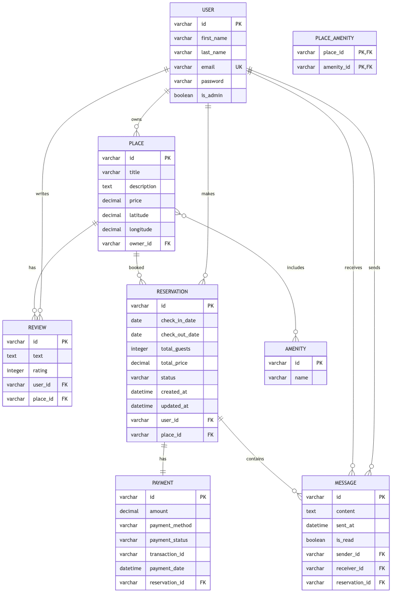

# HBnB Evolution - Part 3: Persistence and Advanced Features

## Author

- **Hector Soto**

## 📖 Overview

Part 3 of the HBnB Evolution project introduces advanced persistence capabilities, authentication, and business logic validation. This iteration builds upon the foundation established in Parts 1 and 2, implementing SQLAlchemy ORM, JWT authentication, password hashing, and comprehensive API endpoints.

## 🏗️ Architecture

### Project Structure
```
part3/
├── app/
│   ├── __init__.py                 # Flask app factory with extensions
│   ├── models/                     # Data models
│   │   ├── __init__.py
│   │   ├── base_model.py           # Base model with common fields
│   │   ├── user.py                 # User entity
│   │   ├── place.py                # Place entity  
│   │   ├── amenity.py              # Amenity entity
│   │   └── review.py               # Review entity
│   ├── api/
│   │   ├── __init__.py
│   │   └── v1/
│   │       ├── __init__.py         # API blueprint registration
│   │       ├── auth.py             # Authentication endpoints
│   │       ├── users.py            # User management endpoints
│   │       ├── places.py           # Place management endpoints
│   │       ├── amenities.py        # Amenity management endpoints
│   │       ├── reviews.py          # Review management endpoints
│   │       └── protected.py        # Protected route examples
│   ├── services/
│   │   ├── __init__.py
│   │   ├── facade.py               # In-memory business logic
│   │   ├── facade_db.py            # Database-ready facade
│   │   ├── facade_sqlalchemy.py    # Complete SQLAlchemy facade
│   │   └── repositories/
│   │       ├── __init__.py
│   │       └── user_repository.py  # User-specific database operations
│   └── persistence/
│       ├── __init__.py
│       └── repository.py           # Repository pattern implementation
├── tests/                          # Test files and examples
├── config.py                       # Application configuration
├── run.py                          # Application entry point
├── requirements.txt                # Python dependencies
├── BCRYPT_USAGE.md                # Password hashing guide
├── SQLALCHEMY_IMPLEMENTATION_SUMMARY.md  # Database implementation details
└── README.md                       # This file
```

## 🚀 Features

### Authentication & Security
- **JWT Token Authentication**: Secure API access with JSON Web Tokens
- **Password Hashing**: Bcrypt integration for secure password storage
- **Role-Based Access Control**: Admin and regular user permissions
- **Protected Routes**: JWT-required endpoints

### Data Models
- **User Management**: Registration, authentication, profile management
- **Place Management**: Property listings with owner relationships
- **Amenity System**: Reusable amenities for places
- **Review System**: User reviews for places with rating validation

### Persistence Options
- **In-Memory Storage**: Fast development and testing
- **SQLAlchemy ORM**: Production-ready database persistence
- **Repository Pattern**: Flexible data access layer
- **Multiple Facade Implementations**: Seamless switching between storage types

### API Features
- **RESTful Design**: Standard HTTP methods and status codes
- **OpenAPI Documentation**: Auto-generated API docs with Flask-RESTX
- **Request Validation**: Input validation and sanitization
- **Error Handling**: Comprehensive error responses
- **CORS Support**: Cross-origin resource sharing

## 🛠️ Technology Stack

### Core Framework
- **Flask**: Web framework
- **Flask-RESTX**: REST API with Swagger documentation
- **SQLAlchemy**: ORM for database operations
- **Flask-SQLAlchemy**: Flask integration for SQLAlchemy

### Security
- **Flask-JWT-Extended**: JWT token management
- **Flask-Bcrypt**: Password hashing
- **UUID**: Unique identifier generation

### Development Tools
- **pycodestyle**: Code style enforcement
- **pytest**: Testing framework (tests included)

## 📦 Installation

### Prerequisites
- Python 3.8+
- pip package manager

### Setup
1. **Clone and Navigate**:
   ```bash
   cd part3
   ```

2. **Create Virtual Environment**:
   ```bash
   python3 -m venv venv
   source venv/bin/activate  # On Windows: venv\Scripts\activate
   ```

3. **Install Dependencies**:
   ```bash
   pip install -r requirements.txt
   ```

4. **Environment Configuration** (Optional):
   ```bash
   export SECRET_KEY="your-secret-key"
   export JWT_SECRET_KEY="your-jwt-secret"
   ```

## 🏃‍♂️ Running the Application

### Development Server
```bash
python run.py
```
The application will start on `http://localhost:5001`

### API Documentation
Access the interactive API documentation at:
- **Swagger UI**: `http://localhost:5001/`
- **API Endpoints**: `http://localhost:5001/api/v1/`

## ER Diagram

The `hbnb.er` file contains the Entity-Relationship diagram definitions for the project, capturing the structure of database entities and their relationships:

```plaintext
[User]
*id {label: "varchar, primary key"}
first_name {label: "varchar"}
last_name {label: "varchar"}
email {label: "varchar, unique"}
password {label: "varchar"}
is_admin {label: "boolean"}

[Place]
*id {label: "varchar, primary key"}
title {label: "varchar"}
description {label: "text"}
price {label: "decimal"}
latitude {label: "decimal"}
longitude {label: "decimal"}
+owner_id {label: "varchar, foreign key"}

[Review]
*id {label: "varchar, primary key"}
text {label: "text"}
rating {label: "integer"}
+user_id {label: "varchar, foreign key"}
+place_id {label: "varchar, foreign key"}

[Amenity]
*id {label: "varchar, primary key"}
name {label: "varchar"}

[Place_Amenity]
*+place_id {label: "varchar, foreign key"}
*+amenity_id {label: "varchar, foreign key"}

[Reservation]
*id {label: "varchar, primary key"}
check_in_date {label: "date"}
check_out_date {label: "date"}
total_guests {label: "integer"}
total_price {label: "decimal"}
status {label: "varchar"}
created_at {label: "datetime"}
updated_at {label: "datetime"}
+user_id {label: "varchar, foreign key"}
+place_id {label: "varchar, foreign key"}

[Payment]
*id {label: "varchar, primary key"}
amount {label: "decimal"}
payment_method {label: "varchar"}
payment_status {label: "varchar"}
transaction_id {label: "varchar"}
payment_date {label: "datetime"}
+reservation_id {label: "varchar, foreign key"}

[Message]
*id {label: "varchar, primary key"}
content {label: "text"}
sent_at {label: "datetime"}
is_read {label: "boolean"}
+sender_id {label: "varchar, foreign key"}
+receiver_id {label: "varchar, foreign key"}
+reservation_id {label: "varchar, foreign key"}

# Relationships
User ||--o{ Place
User ||--o{ Review
User ||--o{ Reservation
User ||--o{ Message
Place ||--o{ Review
Place ||--o{ Reservation
Place }o--o{ Amenity
Reservation ||--|| Payment
Reservation ||--o{ Message
```

To create a visual diagram from this definition, run:
```bash
erd hbnb.er -o hbnb.png
```

### Generated Diagram

The visual representation of the database schema:



*Figure: Entity-Relationship Diagram showing the complete database schema with entities, attributes, and relationships.*

## 📡 API Endpoints

### Authentication
- `POST /api/v1/auth/login` - User authentication
- `POST /api/v1/auth/protected` - Protected route example

### User Management
- `GET /api/v1/users/` - List all users
- `POST /api/v1/users/` - Create new user (admin only after first user)
- `GET /api/v1/users/{id}` - Get user details
- `PUT /api/v1/users/{id}` - Update user (admin only)

### Place Management
- `GET /api/v1/places/` - List all places
- `POST /api/v1/places/` - Create new place (authenticated)
- `GET /api/v1/places/{id}` - Get place details
- `PUT /api/v1/places/{id}` - Update place (owner or admin)

### Amenity Management
- `GET /api/v1/amenities/` - List all amenities
- `POST /api/v1/amenities/` - Create amenity (admin only)
- `GET /api/v1/amenities/{id}` - Get amenity details
- `PUT /api/v1/amenities/{id}` - Update amenity (admin only)

### Review Management
- `GET /api/v1/reviews/` - List all reviews
- `POST /api/v1/reviews/` - Create review (authenticated)
- `GET /api/v1/reviews/{id}` - Get review details
- `PUT /api/v1/reviews/{id}` - Update review (author or admin)
- `DELETE /api/v1/reviews/{id}` - Delete review (author or admin)

## 🗄️ Database Configuration

### SQLite (Development)
The application uses SQLite by default:
```python
SQLALCHEMY_DATABASE_URI = 'sqlite:///development.db'
```

### Database Initialization
```bash
python init_db.py  # Initialize database schema
```

### Repository Pattern
The application implements a flexible repository pattern supporting both in-memory and database storage:

```python
# In-memory repository
from app.services.facade import facade

# SQLAlchemy repository  
from app.services.facade_sqlalchemy import facade
```

## 🔐 Authentication Flow

### First User (Auto-Admin)
The first user created automatically becomes an admin:
```bash
curl -X POST "http://localhost:5001/api/v1/users/" \
  -H "Content-Type: application/json" \
  -d '{"first_name": "Admin", "last_name": "User", "email": "admin@example.com", "password": "admin123"}'
```

### User Login
```bash
curl -X POST "http://localhost:5001/api/v1/auth/login" \
  -H "Content-Type: application/json" \
  -d '{"email": "admin@example.com", "password": "admin123"}'
```

### Using JWT Token
```bash
curl -X GET "http://localhost:5001/api/v1/auth/protected" \
  -H "Authorization: Bearer YOUR_JWT_TOKEN"
```

## 🧪 Testing

### Running Tests
```bash
# Run all tests
python -m pytest tests/

# Run specific test file
python tests/test_user_endpoints.py

# Run with verbose output
python -m pytest tests/ -v
```

### Example Test Scripts
- `tests/test_user_endpoints.py` - User API testing
- `tests/test_amenity_creation.py` - Amenity management testing
- `tests/test_reviews_api.py` - Review system testing
- `tests/test_models.py` - Model validation testing

### Manual Testing Examples
```bash
# Test user creation
python tests/example_user_creation.py

# Test review system
python tests/example_review_api.py

# Test place registration
python tests/test_place_registration.py
```

## 🔍 Code Quality

### Style Guidelines
The project follows PEP 8 style guidelines:
```bash
# Check code style
pycodestyle app/

# Auto-format code (if autopep8 is installed)
autopep8 --in-place --recursive app/
```

## 🏢 Business Logic

### User Management
- **Admin Privileges**: First user becomes admin automatically
- **Email Uniqueness**: Enforced across the system
- **Password Security**: Bcrypt hashing with salt

### Place Management
- **Owner Relationships**: Users can own multiple places
- **Amenity Associations**: Many-to-many relationship with amenities
- **Validation**: Price, location, and description validation

### Review System
- **User Restrictions**: Users cannot review their own places
- **One Review Per Place**: One review per user per place
- **Rating Validation**: 1-5 star rating system
- **Author Permissions**: Only authors and admins can modify reviews

### Data Integrity
- **UUID Primary Keys**: Consistent across all entities
- **Timestamp Tracking**: Created and updated timestamps
- **Referential Integrity**: Foreign key constraints and validations


## 🐛 Troubleshooting

### Common Issues

1. **Port Already in Use**:
   ```bash
   # Change port in run.py or kill existing process
   lsof -ti:5001 | xargs kill -9
   ```

2. **Database Connection Issues**:
   ```bash
   # Reinitialize database
   rm -f instance/development.db
   python init_db.py
   ```

3. **Import Errors**:
   ```bash
   # Ensure you're in the correct directory and virtual environment
   source venv/bin/activate
   ```

4. **JWT Token Expired**:
   ```bash
   # Login again to get a new token
   curl -X POST "http://localhost:5001/api/v1/auth/login" ...
   ```

## 🔮 Future Enhancements

### Planned Features
- **Image Upload**: Place and user profile images
- **Search & Filtering**: Advanced place search capabilities
- **Pagination**: Large dataset handling
- **Caching**: Redis integration for performance
- **Email Notifications**: User communication system
- **Geographic Search**: Location-based place discovery

### Database Optimizations
- **Indexing**: Performance optimization
- **Connection Pooling**: Production deployment ready
- **Migration System**: Schema versioning
- **Backup Strategies**: Data protection

## 👥 Contributing

### Development Workflow
1. Follow PEP 8 style guidelines
2. Write tests for new features
3. Update documentation
4. Ensure all tests pass

### Code Review Checklist
- [ ] Code follows PEP 8 standards
- [ ] Tests are included and passing
- [ ] Documentation is updated
- [ ] API endpoints are properly secured
- [ ] Error handling is comprehensive

## 📄 License

This project is part of the Holberton School curriculum and is intended for educational purposes.

---

**Version**: 3.0  
**Last Updated**: January 2025  
**Python Version**: 3.8+  
**Framework**: Flask 3.1.1
