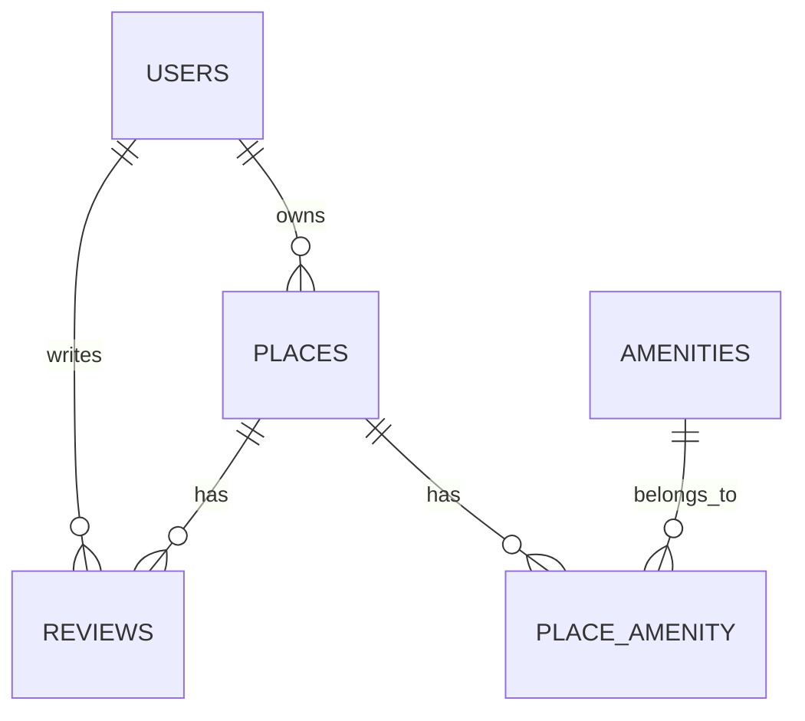
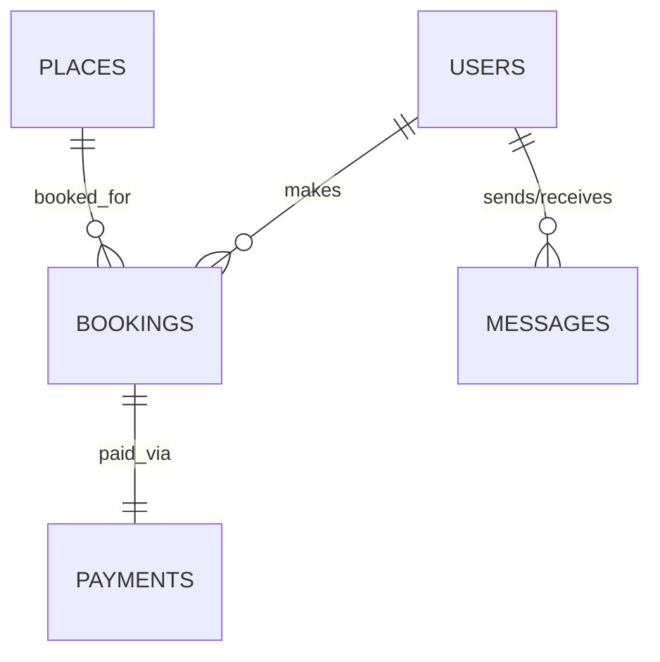

# HBnB Database Diagrams Documentation

This directory contains Entity-Relationship (ER) diagrams for the HBnB database schema created using Mermaid.js.

## Files Overview

- `hbnb_er_diagram.md` - Main ER diagram for the core database schema
- `hbnb_extended_er_diagram.md` - Extended schema with booking system
- `relationship_types_diagram.md` - Focused diagram showing relationship types
- `README.md` - This documentation file

## Viewing the Diagrams

### Method 1: GitHub/GitLab (Recommended)
Simply view the `.md` files directly on GitHub or GitLab - they render Mermaid diagrams automatically.

### Method 2: Mermaid Live Editor
1. Go to [Mermaid Live Editor](https://mermaid.live/)
2. Copy the diagram code from any `.md` file
3. Paste it into the editor
4. View and export the diagram

### Method 3: VS Code Extension
1. Install the "Mermaid Markdown Syntax Highlighting" extension
2. Open any `.md` file in VS Code
3. Use the preview mode to view the diagrams

### Method 4: Export as Images
1. Use Mermaid Live Editor to export as PNG/SVG
2. Use mermaid-cli: `mmdc -i diagram.md -o diagram.png`

## Diagram Types Included

### 1. Main Database Schema (`hbnb_er_diagram.md`)

**Purpose**: Shows the core database structure for HBnB
**Entities**: USERS, PLACES, REVIEWS, AMENITIES, PLACE_AMENITY
**Relationships**: All core one-to-many and many-to-many relationships



### 2. Extended Schema (`hbnb_extended_er_diagram.md`)

**Purpose**: Shows expanded database with booking system
**Additional Entities**: BOOKINGS, PAYMENTS, MESSAGES
**New Relationships**: Booking system, payment processing, messaging



### 3. Relationship Types (`relationship_types_diagram.md`)

**Purpose**: Educational diagram focusing on relationship notation
**Focus**: Explains Mermaid.js relationship symbols
**Use Case**: Learning and reference for relationship types

## Mermaid.js Syntax Reference

### Entity Definition
```mermaid
ENTITY_NAME {
    datatype column_name "constraints"
    string id PK "Primary Key"
    string name UK "Unique Key"
    string foreign_id FK "Foreign Key"
}
```

### Relationship Notation
| Symbol | Meaning | Example |
|--------|---------|---------|
| `||--o{` | One-to-Many | `USER ||--o{ PLACE` |
| `}o--||` | Many-to-One | `PLACE }o--|| USER` |
| `||--||` | One-to-One | `BOOKING ||--|| PAYMENT` |
| `}o--o{` | Many-to-Many | `PLACE }o--o{ AMENITY` |

### Constraint Notation
- `PK` - Primary Key
- `FK` - Foreign Key
- `UK` - Unique Key
- `"NOT NULL"` - Required field
- `"UNIQUE"` - Unique constraint
- `"CHECK (1-5)"` - Check constraint

## Database Schema Summary

### Core Entities
1. **USERS** - User accounts with authentication
2. **PLACES** - Property listings
3. **REVIEWS** - User reviews for places
4. **AMENITIES** - Available amenities
5. **PLACE_AMENITY** - Many-to-many junction table

### Extended Entities (Future Implementation)
1. **BOOKINGS** - Reservation system
2. **PAYMENTS** - Payment processing
3. **MESSAGES** - User communication

## Relationship Summary

### One-to-Many Relationships
- User → Places (A user owns many places)
- User → Reviews (A user writes many reviews)
- Place → Reviews (A place has many reviews)
- User → Bookings (A user makes many bookings)
- Place → Bookings (A place has many bookings)

### Many-to-Many Relationships
- Place ↔ Amenity (Places have many amenities, amenities belong to many places)

### One-to-One Relationships
- Booking → Payment (Each booking has one payment)

## Business Rules Enforced

### Data Integrity
- All tables use UUID primary keys
- Foreign keys enforce referential integrity
- Unique constraints prevent duplicates
- Check constraints validate data ranges

### Business Logic
- Users cannot review their own places
- Each user can only review a place once
- Review ratings must be between 1 and 5
- Email addresses must be unique
- Amenity names must be unique

## Using These Diagrams

### For Development
1. **Schema Reference**: Use as a reference when writing SQL queries
2. **Relationship Understanding**: Understand how tables relate to each other
3. **Constraint Planning**: See what constraints are enforced
4. **API Development**: Understand data relationships for API endpoints

### For Documentation
1. **Project Documentation**: Include in project README or wiki
2. **Team Communication**: Share with team members for understanding
3. **Database Design**: Use for database design discussions
4. **Code Reviews**: Reference during code reviews

### For Learning
1. **ER Diagram Concepts**: Learn how to read and create ER diagrams
2. **Database Design**: Understand database normalization and relationships
3. **Mermaid.js**: Learn Mermaid.js syntax for diagram creation
4. **SQL Relationships**: Understand how relationships work in SQL

## Exporting Diagrams

### As Images
```bash
# Using mermaid-cli
npm install -g @mermaid-js/mermaid-cli
mmdc -i hbnb_er_diagram.md -o hbnb_er_diagram.png
```

### As PDF
```bash
# Using mermaid-cli
mmdc -i hbnb_er_diagram.md -o hbnb_er_diagram.pdf
```

### As SVG
```bash
# Using mermaid-cli
mmdc -i hbnb_er_diagram.md -o hbnb_er_diagram.svg
```

## Integration with Documentation

### GitHub/GitLab
- Diagrams render automatically in README files
- Include in project documentation
- Reference in pull requests and issues

### Confluence/Notion
- Export as images and embed
- Copy Mermaid code into supported platforms
- Use for technical documentation

### Presentations
- Export as high-quality images
- Include in architecture presentations
- Use for database design discussions

## Maintenance

### Updating Diagrams
1. Modify the Mermaid code in the `.md` files
2. Test changes in Mermaid Live Editor
3. Commit changes to version control
4. Update documentation as needed

### Adding New Entities
1. Add entity definition to appropriate diagram
2. Define relationships with existing entities
3. Update constraints and business rules
4. Test diagram rendering

### Version Control
- Track changes to diagrams in git
- Include meaningful commit messages
- Tag major schema changes
- Maintain changelog for schema updates

## Troubleshooting

### Common Issues
1. **Syntax Errors**: Check Mermaid syntax in Live Editor
2. **Rendering Issues**: Ensure platform supports Mermaid rendering
3. **Relationship Errors**: Verify entity names match exactly
4. **Constraint Notation**: Use consistent constraint notation

### Best Practices
1. Keep entity names in UPPERCASE
2. Use descriptive relationship labels
3. Include all constraints in entity definitions
4. Test diagrams before committing
5. Keep diagrams up-to-date with schema changes

## Resources

- [Mermaid.js Documentation](https://mermaid.js.org/)
- [Mermaid Live Editor](https://mermaid.live/)
- [GitHub Mermaid Support](https://github.blog/2022-02-14-include-diagrams-markdown-files-mermaid/)
- [Database Design Principles](https://www.lucidchart.com/pages/database-diagram/database-design)
- [ER Diagram Best Practices](https://www.lucidchart.com/pages/er-diagrams)
