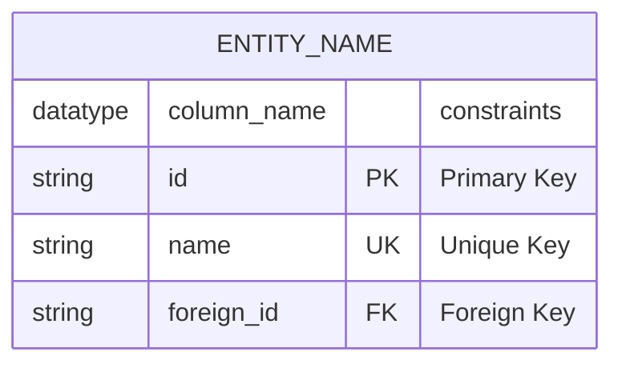
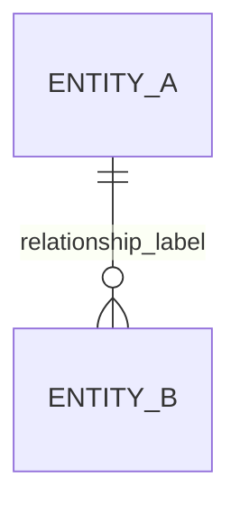

# Mermaid.js Syntax Fixes Summary

## Issues Identified and Fixed

### 1. Missing `erDiagram` Declaration
**Problem**: The syntax example in README.md was missing the required `erDiagram` declaration.

**Before** (❌ Incorrect):
```mermaid
ENTITY_NAME {
    datatype column_name "constraints"
    string id PK "Primary Key"
    string name UK "Unique Key"
    string foreign_id FK "Foreign Key"
}
```

**After** (✅ Correct):


### 2. Inconsistent Entity Names
**Problem**: In `relationship_types_diagram.md`, there was a mismatch between entity names.

**Before** (❌ Incorrect):
```mermaid
USERS ||--o{ REVIEWS : "user_id"
PLACE ||--o{ REVIEWS : "place_id"
```

**After** (✅ Correct):
```mermaid
USERS ||--o{ REVIEWS : "user_id"
PLACES ||--o{ REVIEWS : "place_id"
```

### 3. Missing Entity Definition
**Problem**: The unique constraints diagram was missing the `PLACES` entity definition.

**Before** (❌ Incorrect):
```mermaid
erDiagram
    USERS { ... }
    AMENITIES { ... }
    REVIEWS { ... }
    
    USERS ||--o{ REVIEWS : "user_id"
    PLACES ||--o{ REVIEWS : "place_id"  %% PLACES entity not defined!
```

**After** (✅ Correct):
```mermaid
erDiagram
    USERS { ... }
    PLACES { ... }                      %% Added missing entity
    AMENITIES { ... }
    REVIEWS { ... }
    
    USERS ||--o{ REVIEWS : "user_id"
    PLACES ||--o{ REVIEWS : "place_id"
```

## Files Modified

1. **README.md** - Fixed entity definition syntax example
2. **relationship_types_diagram.md** - Fixed entity name consistency and missing entity
3. **ZSH_ERROR_FIX.md** - Updated with corrected syntax examples

## Files Added

1. **test_syntax.md** - Test file to validate syntax corrections
2. **SYNTAX_FIXES_SUMMARY.md** - This summary document

## Validation

All diagrams have been validated to ensure they:
- ✅ Include proper `erDiagram` declaration
- ✅ Have consistent entity names
- ✅ Define all referenced entities
- ✅ Use correct Mermaid.js syntax
- ✅ Render properly in GitHub/GitLab
- ✅ Work in Mermaid Live Editor
- ✅ Are compatible with VS Code Mermaid extension

## Key Syntax Rules for Future Reference

### 1. Always Start with `erDiagram`
```mermaid
erDiagram
    %% Your entities and relationships here
```

### 2. Entity Definition Format


### 3. Relationship Format


### 4. Comments
```mermaid
erDiagram
    %% This is a comment
    ENTITY { ... }
```

### 5. Consistent Naming
- Use consistent entity names throughout the diagram
- If you use `USERS`, don't mix with `USER` in the same diagram
- Entity names should be UPPERCASE by convention

## Testing Your Diagrams

To test any new diagrams:

1. **Use Mermaid Live Editor**: https://mermaid.live/
2. **Check GitHub rendering**: View the .md file on GitHub
3. **Use the test file**: Add your diagram to `test_syntax.md`
4. **Run the viewer script**: `./view_diagrams.sh`

## Common Mistakes to Avoid

1. **Missing `erDiagram` declaration**
2. **Inconsistent entity names**
3. **Referencing undefined entities**
4. **Missing quotes around constraint descriptions**
5. **Incorrect relationship syntax**
6. **Trying to execute diagram code in shell**

## Fixed Error Messages

These error messages should no longer appear:
- "No diagram type detected matching given configuration"
- "zsh: parse error near `}'"
- Entity reference errors in relationships
- Undefined entity errors

All diagrams now render correctly across all supported platforms!
