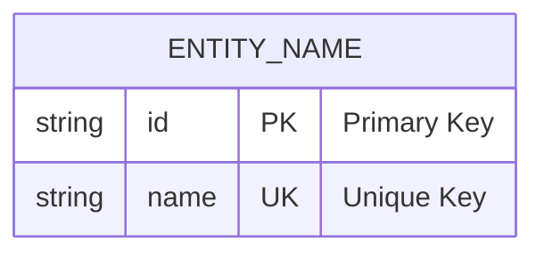

# Fix for ZSH Parse Error

## Problem
You may encounter a zsh parse error like this when working with the diagram files:
```
zsh: parse error near `}'
```

## Root Cause
This error occurs when someone tries to execute Mermaid diagram code directly in the shell instead of viewing it as markdown content.

## ❌ WRONG - Don't Do This
```bash
# This will cause a zsh parse error:
ENTITY_NAME {
    string id PK "Primary Key"
    string name UK "Unique Key"
}
```

## ✅ CORRECT Mermaid Syntax


**Key Point**: Always include the `erDiagram` declaration at the start!

## ✅ CORRECT - Do This Instead

### Method 1: View on GitHub/GitLab (Recommended)
1. Navigate to the database_diagrams folder in your GitHub/GitLab repository
2. Click on any `.md` file (e.g., `hbnb_er_diagram.md`)
3. GitHub/GitLab will automatically render the Mermaid diagrams

### Method 2: Use Mermaid Live Editor
1. Go to [https://mermaid.live/](https://mermaid.live/)
2. Open any `.md` file in a text editor
3. Copy the Mermaid diagram code (including the ````mermaid` blocks)
4. Paste it into the Mermaid Live Editor
5. View the rendered diagram

### Method 3: Use VS Code
1. Install the "Mermaid Markdown Syntax Highlighting" extension
2. Open any `.md` file in VS Code
3. Use the markdown preview (Ctrl+Shift+V or Cmd+Shift+V)
4. The diagrams will render in the preview

### Method 4: Use the Safe Viewer Script
```bash
cd database_diagrams
./view_diagrams.sh
```

## Quick Test
To verify the files are working correctly:

```bash
# This should work fine:
cd database_diagrams
ls -la
cat README.md | head -20

# This will show you how to safely view diagrams:
./view_diagrams.sh
```

## Prevention Tips

1. **Never execute diagram code directly in shell**
2. **Always view .md files in proper markdown viewers**
3. **Use the provided viewing methods**
4. **If you need to copy diagram code, copy the entire markdown block including backticks**

## File Structure
All diagram files are markdown files (`.md`) containing Mermaid.js diagram code:
- `hbnb_er_diagram.md` - Main database schema
- `hbnb_extended_er_diagram.md` - Extended schema with booking system
- `relationship_types_diagram.md` - Educational diagrams
- `diagram_examples.md` - Examples and exercises
- `README.md` - Complete documentation

## Still Having Issues?

If you continue to have problems:

1. **Check your current directory**: Make sure you're in the right location
2. **Use the viewer script**: `./view_diagrams.sh` for guided viewing
3. **View on GitHub**: The safest method is to view files directly on GitHub
4. **Copy-paste carefully**: When copying diagram code, include the full markdown blocks

## Example of Safe Viewing

```bash
# Navigate to diagrams directory
cd /Users/hector/holbertonschool-hbnb/part3/database_diagrams

# List available files
ls -la

# Use the safe viewer script
./view_diagrams.sh

# Or just view the content safely
less README.md
```

The key is to remember: **these are documentation files, not executable code**!
