# Database Diagram Examples and Testing

## Quick Test Diagrams

### Simple User-Place Relationship
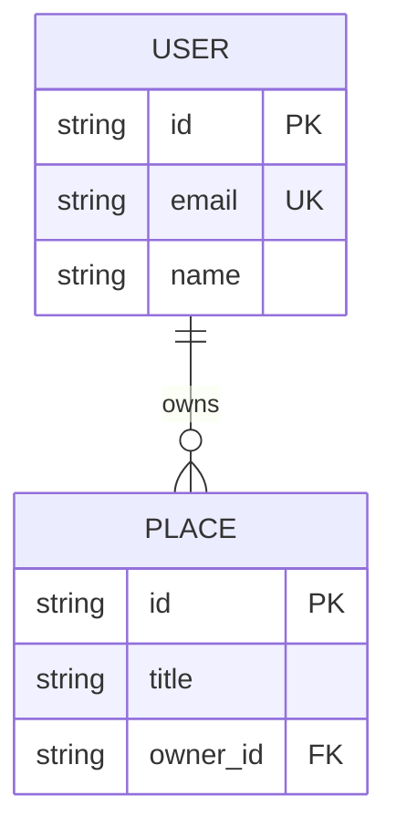

### Review System
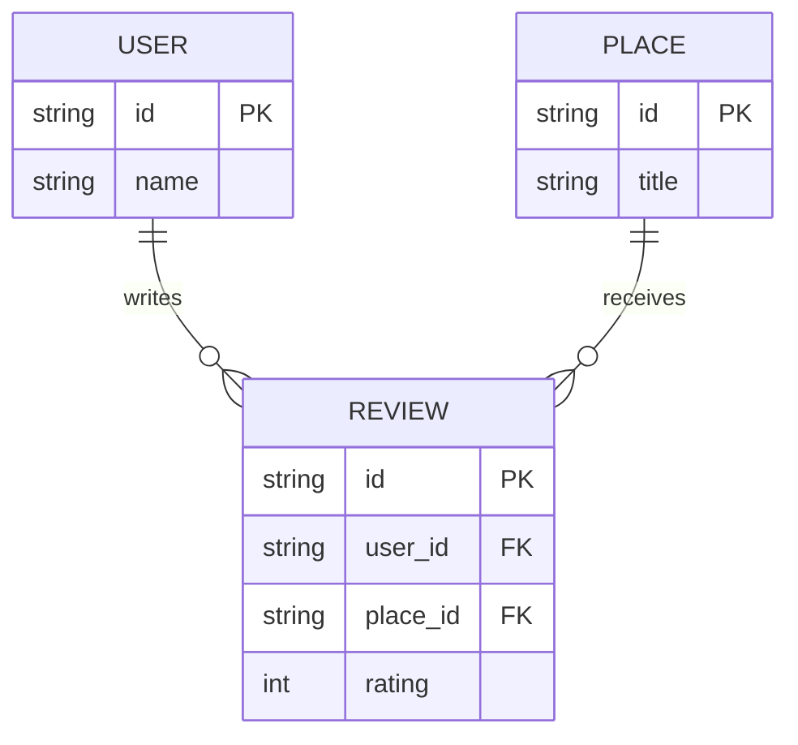

### Many-to-Many Amenities
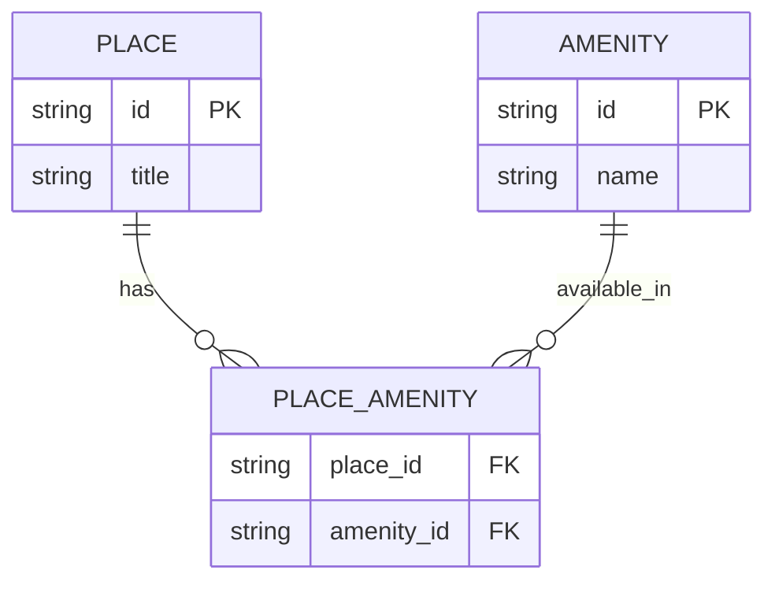

## Data Flow Examples

### User Registration and Place Creation Flow
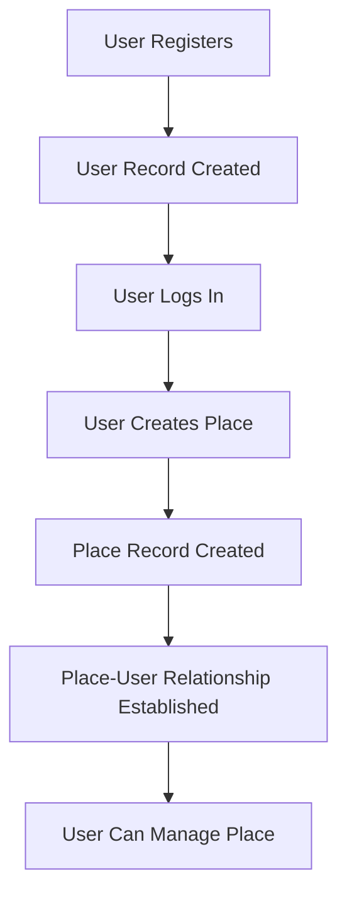

### Review Creation Flow
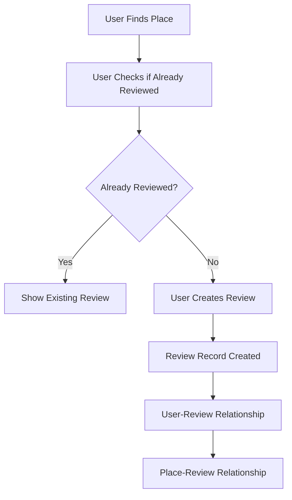

## Database Query Examples

### SQL Queries Based on Relationships

#### 1. Get All Places Owned by a User
```sql
SELECT p.* 
FROM places p 
JOIN users u ON p.owner_id = u.id 
WHERE u.email = 'user@example.com';
```

#### 2. Get All Reviews for a Place
```sql
SELECT r.*, u.first_name, u.last_name 
FROM reviews r 
JOIN users u ON r.user_id = u.id 
WHERE r.place_id = '12345';
```

#### 3. Get Places with Specific Amenities
```sql
SELECT p.* 
FROM places p 
JOIN place_amenity pa ON p.id = pa.place_id 
JOIN amenities a ON pa.amenity_id = a.id 
WHERE a.name = 'WiFi';
```

#### 4. Get Average Rating for Each Place
```sql
SELECT p.title, AVG(r.rating) as avg_rating 
FROM places p 
LEFT JOIN reviews r ON p.id = r.place_id 
GROUP BY p.id, p.title;
```

## Testing Your Understanding

### Exercise 1: Add a Photo Entity
Create a diagram that adds a PHOTOS entity to the database:
- Photos belong to places
- Each photo has an id, filename, and description
- A place can have multiple photos

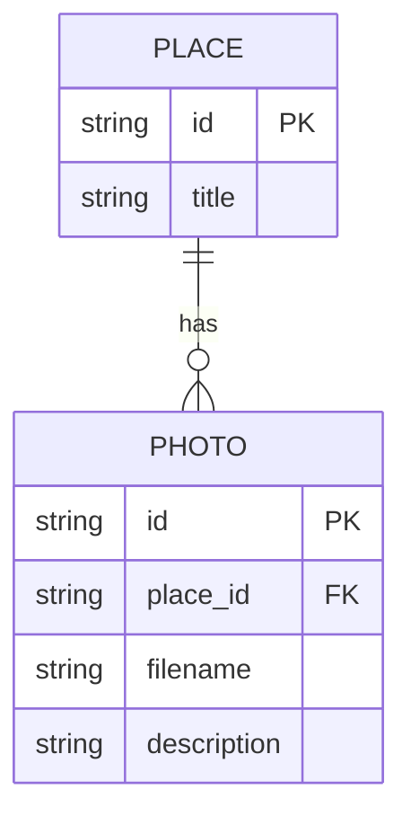

### Exercise 2: Add User Preferences
Create a diagram showing user preferences for amenities:
- Users can have preferred amenities
- This is a many-to-many relationship
- Track preference level (1-5)

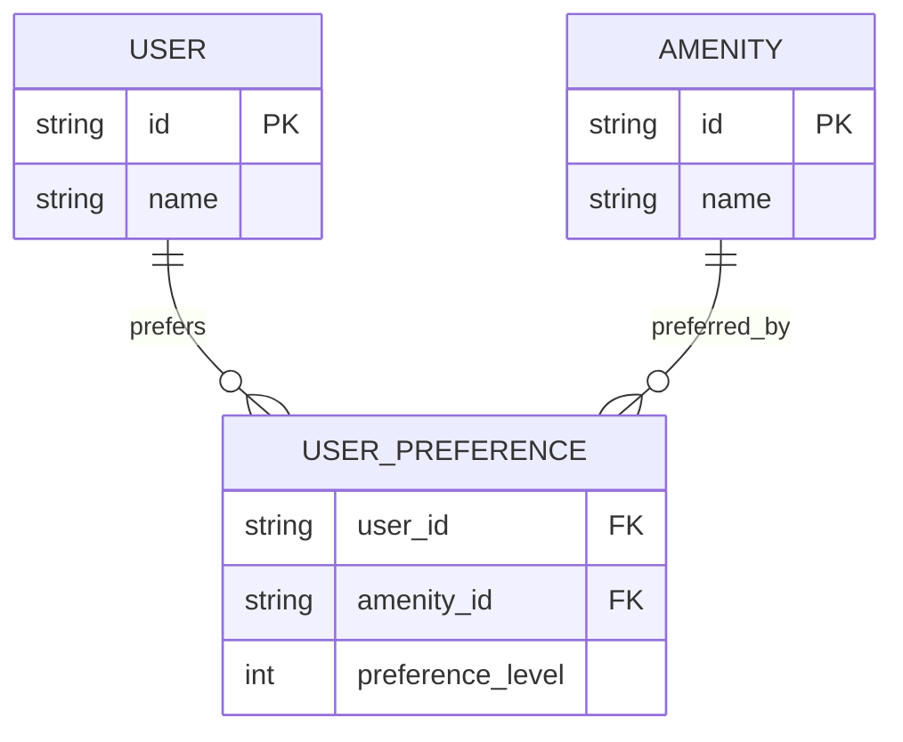

### Exercise 3: Add Location Hierarchy
Create a diagram showing places within cities and countries:
- Countries have many cities
- Cities have many places
- Show the hierarchy relationships

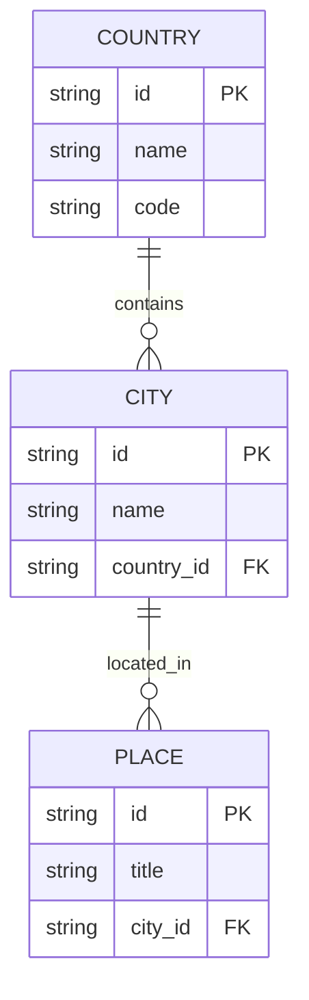

## Common Diagram Patterns

### 1. One-to-Many Pattern
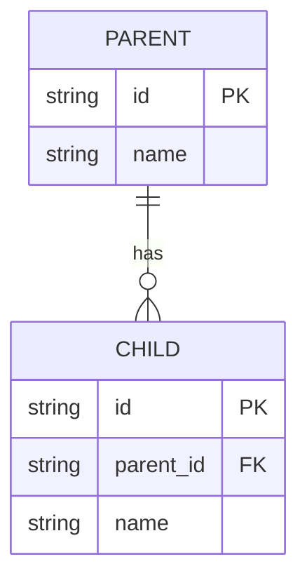

### 2. Many-to-Many Pattern
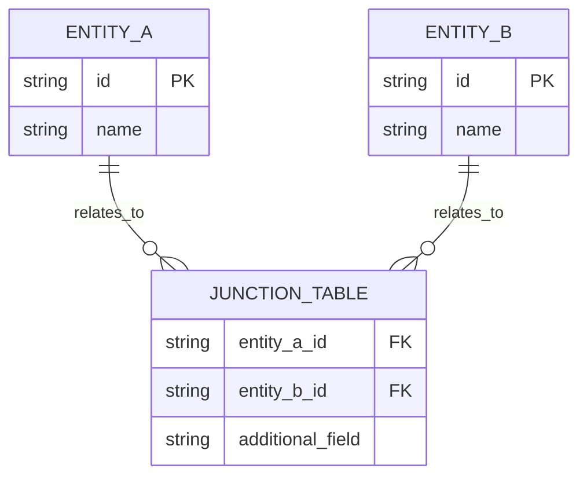

### 3. Self-Referencing Pattern
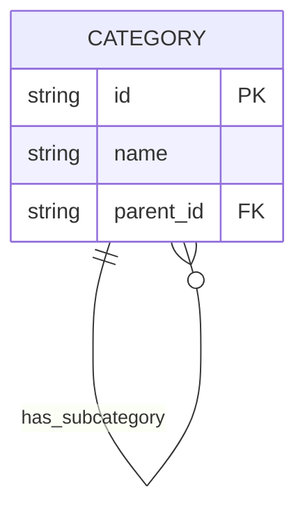

## Validation Checklist

When creating or reviewing diagrams, check:

### Entity Validation
- [ ] All entities have primary keys
- [ ] Entity names are clear and descriptive
- [ ] Attributes have appropriate data types
- [ ] Constraints are documented

### Relationship Validation
- [ ] Relationship cardinality is correct
- [ ] Foreign keys are properly placed
- [ ] Junction tables are used for many-to-many
- [ ] Relationship names are descriptive

### Business Logic Validation
- [ ] All business rules are represented
- [ ] Constraints match requirements
- [ ] No redundant relationships
- [ ] Normalization is appropriate

## Testing Diagrams in Practice

### 1. Mermaid Live Editor Test
1. Copy diagram code to [Mermaid Live Editor](https://mermaid.live/)
2. Check for syntax errors
3. Verify visual representation
4. Export if needed

### 2. GitHub Rendering Test
1. Create a test markdown file
2. Include diagram code
3. Check rendering on GitHub
4. Verify all elements display correctly

### 3. Documentation Integration Test
1. Include diagram in project README
2. Test rendering in different environments
3. Verify links and references work
4. Check mobile/responsive display

## Best Practices Summary

### Naming Conventions
- Use UPPERCASE for entity names
- Use snake_case for attributes
- Use descriptive relationship labels
- Be consistent throughout diagrams

### Visual Organization
- Group related entities together
- Use consistent spacing
- Minimize line crossings
- Include all necessary constraints

### Documentation
- Include entity descriptions
- Document business rules
- Explain relationship meanings
- Provide usage examples

## Common Mistakes to Avoid

1. **Missing Foreign Keys**: Always include FK attributes
2. **Wrong Cardinality**: Verify one-to-many vs many-to-many
3. **Inconsistent Naming**: Use consistent naming conventions
4. **Missing Constraints**: Include all business rule constraints
5. **Overcomplicated Diagrams**: Keep diagrams focused and clear
6. **Outdated Diagrams**: Keep diagrams in sync with implementation
