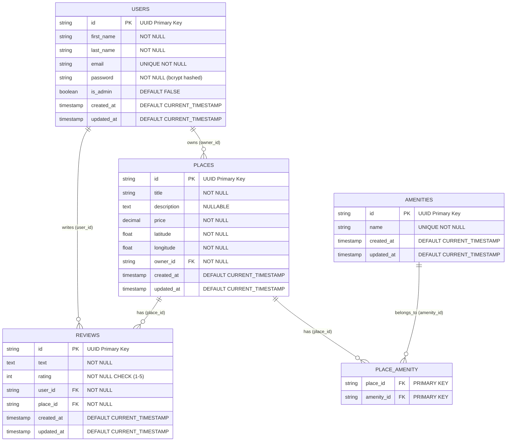

# HBnB Database Entity-Relationship Diagram

## Main Database Schema

## Relationship Explanations

### One-to-Many Relationships

1. **USERS → PLACES** (One-to-Many)
   - A user can own multiple places
   - Each place has exactly one owner
   - Foreign Key: `places.owner_id` → `users.id`

2. **USERS → REVIEWS** (One-to-Many)
   - A user can write multiple reviews
   - Each review is written by exactly one user
   - Foreign Key: `reviews.user_id` → `users.id`

3. **PLACES → REVIEWS** (One-to-Many)
   - A place can have multiple reviews
   - Each review is for exactly one place
   - Foreign Key: `reviews.place_id` → `places.id`

### Many-to-Many Relationships

1. **PLACES ↔ AMENITIES** (Many-to-Many)
   - A place can have multiple amenities
   - An amenity can be available in multiple places
   - Junction Table: `place_amenity` with composite primary key
   - Foreign Keys: `place_amenity.place_id` → `places.id`, `place_amenity.amenity_id` → `amenities.id`

## Database Constraints

- **Primary Keys**: All tables use UUID format for primary keys
- **Foreign Keys**: All references include `ON DELETE CASCADE`
- **Unique Constraints**: 
  - `users.email` (unique email addresses)
  - `amenities.name` (unique amenity names)
  - `reviews(user_id, place_id)` (one review per user per place)
- **Check Constraints**: 
  - `reviews.rating` must be between 1 and 5
- **NOT NULL Constraints**: All required fields are enforced
