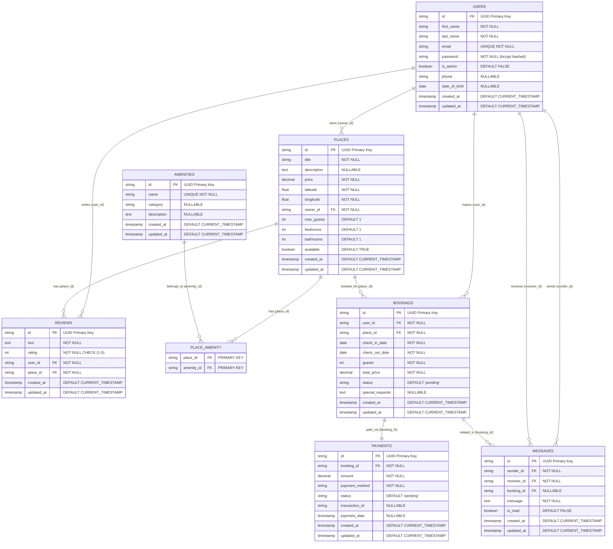

# HBnB Extended Database Entity-Relationship Diagram

## Extended Database Schema with Booking System

## Additional Relationships in Extended Schema

### New One-to-Many Relationships

4. **USERS → BOOKINGS** (One-to-Many)
   - A user can make multiple bookings
   - Each booking is made by exactly one user
   - Foreign Key: `bookings.user_id` → `users.id`

5. **PLACES → BOOKINGS** (One-to-Many)
   - A place can have multiple bookings
   - Each booking is for exactly one place
   - Foreign Key: `bookings.place_id` → `places.id`

6. **USERS → MESSAGES (Sender)** (One-to-Many)
   - A user can send multiple messages
   - Each message has exactly one sender
   - Foreign Key: `messages.sender_id` → `users.id`

7. **USERS → MESSAGES (Receiver)** (One-to-Many)
   - A user can receive multiple messages
   - Each message has exactly one receiver
   - Foreign Key: `messages.receiver_id` → `users.id`

8. **BOOKINGS → MESSAGES** (One-to-Many)
   - A booking can have multiple related messages
   - Each message can be related to zero or one booking
   - Foreign Key: `messages.booking_id` → `bookings.id`

### One-to-One Relationships

9. **BOOKINGS → PAYMENTS** (One-to-One)
   - Each booking has exactly one payment
   - Each payment is for exactly one booking
   - Foreign Key: `payments.booking_id` → `bookings.id`

## Business Rules in Extended Schema

### Booking Constraints
- Check-in date must be before check-out date
- Booking dates cannot overlap for the same place
- Number of guests cannot exceed place's maximum capacity
- Users cannot book their own places

### Payment Constraints
- Payment amount must match booking total price
- Payment status must be one of: 'pending', 'completed', 'failed', 'refunded'
- Payment date is required when status is 'completed'

### Message Constraints
- Sender and receiver must be different users
- Messages related to bookings must involve the booking's user or place owner

## Status Enums

### Booking Status
- `pending`: Awaiting confirmation
- `confirmed`: Booking confirmed
- `cancelled`: Booking cancelled
- `completed`: Stay completed

### Payment Status
- `pending`: Payment not yet processed
- `completed`: Payment successful
- `failed`: Payment failed
- `refunded`: Payment refunded

## Extended Entity Purposes

### BOOKINGS Table
- Manages reservation system
- Tracks booking details and status
- Links users to places with dates
- Stores pricing and guest information

### PAYMENTS Table
- Handles payment processing
- Links to booking for financial tracking
- Stores transaction details
- Supports different payment methods

### MESSAGES Table
- Enables communication between users
- Supports booking-related discussions
- Maintains message history
- Tracks read/unread status
