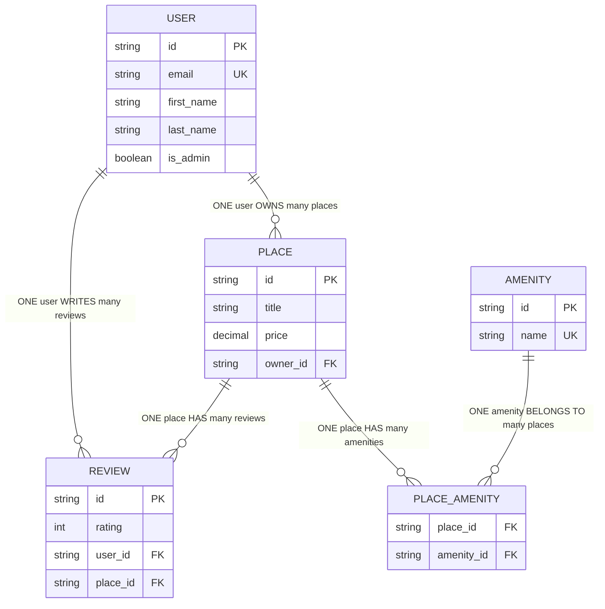
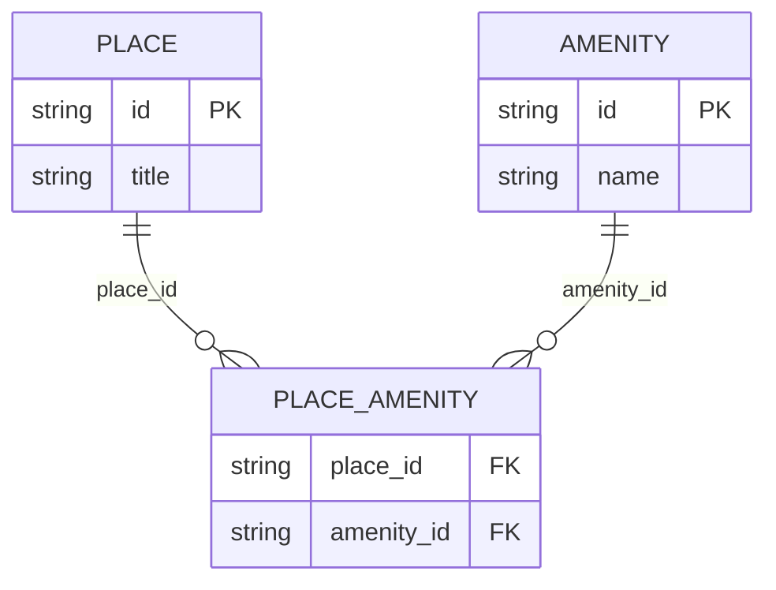
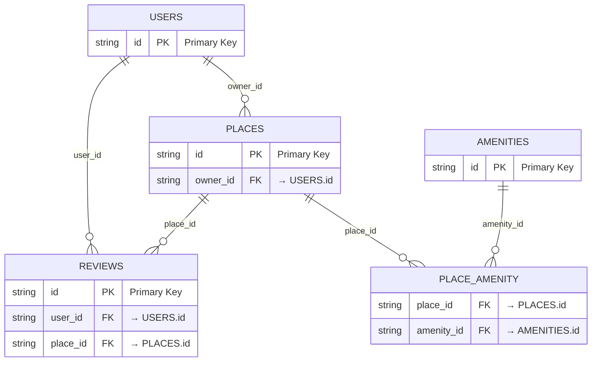

# HBnB Database Relationship Types Diagram

## Relationship Types Visualization



## Relationship Cardinality Explanation

### Mermaid.js Relationship Notation

| Notation | Meaning | Description |
|----------|---------|-------------|
| `||--o{` | One-to-Many | One entity relates to many entities |
| `}o--||` | Many-to-One | Many entities relate to one entity |
| `||--||` | One-to-One | One entity relates to exactly one entity |
| `}o--o{` | Many-to-Many | Many entities relate to many entities |

### Our Database Relationships

1. **USER ||--o{ PLACE** (One-to-Many)
   - **Left side (||)**: One user
   - **Right side (o{)**: Many places
   - **Meaning**: One user can own multiple places

2. **USER ||--o{ REVIEW** (One-to-Many)
   - **Left side (||)**: One user
   - **Right side (o{)**: Many reviews
   - **Meaning**: One user can write multiple reviews

3. **PLACE ||--o{ REVIEW** (One-to-Many)
   - **Left side (||)**: One place
   - **Right side (o{)**: Many reviews
   - **Meaning**: One place can have multiple reviews

4. **PLACE ||--o{ PLACE_AMENITY** (One-to-Many)
   - **Left side (||)**: One place
   - **Right side (o{)**: Many place_amenity records
   - **Meaning**: One place can have multiple amenities

5. **AMENITY ||--o{ PLACE_AMENITY** (One-to-Many)
   - **Left side (||)**: One amenity
   - **Right side (o{)**: Many place_amenity records
   - **Meaning**: One amenity can belong to multiple places

## Many-to-Many Relationship Breakdown

The **PLACE ↔ AMENITY** many-to-many relationship is implemented using a junction table:



### How Many-to-Many Works

1. **Direct Relationship**: PLACE ↔ AMENITY (Many-to-Many)
2. **Implementation**: Through junction table PLACE_AMENITY
3. **Breakdown**: 
   - PLACE → PLACE_AMENITY (One-to-Many)
   - AMENITY → PLACE_AMENITY (One-to-Many)
4. **Result**: A place can have multiple amenities, and an amenity can belong to multiple places

## Foreign Key Constraints



## Unique Constraints

```mermaid
erDiagram
    USERS {
        string id PK
        string email UK "UNIQUE"
        string first_name
        string last_name
    }
    
    AMENITIES {
        string id PK
        string name UK "UNIQUE"
    }
    
    REVIEWS {
        string id PK
        string user_id FK
        string place_id FK
        int rating
        string text
    }
    
    USERS ||--o{ REVIEWS : "user_id"
    PLACE ||--o{ REVIEWS : "place_id"
    
    %% Unique constraint on combination
    REVIEWS : "UNIQUE(user_id, place_id)"
```

### Unique Constraint Types

1. **Single Column Unique**: `users.email`, `amenities.name`
2. **Composite Unique**: `reviews(user_id, place_id)` - One review per user per place
3. **Primary Key Unique**: All `id` fields are unique by definition
