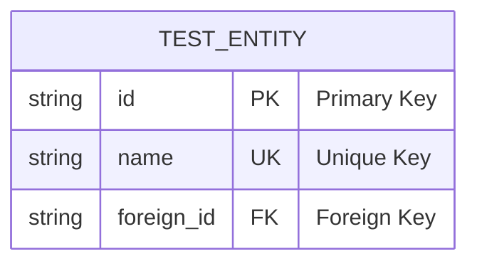
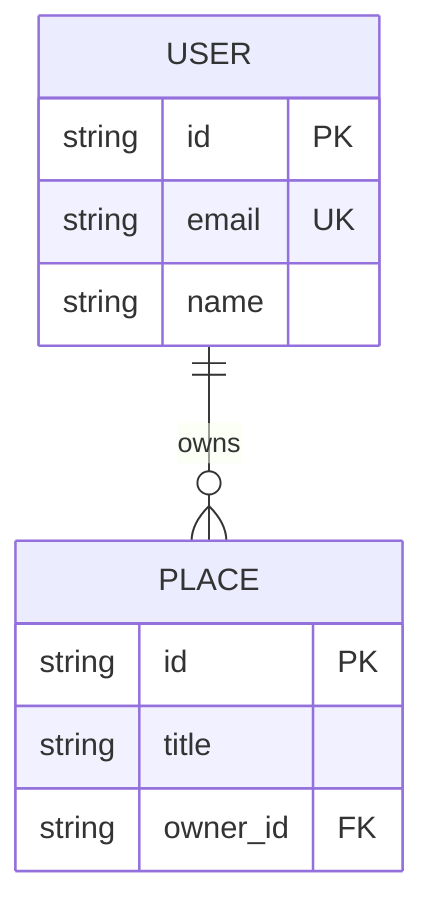
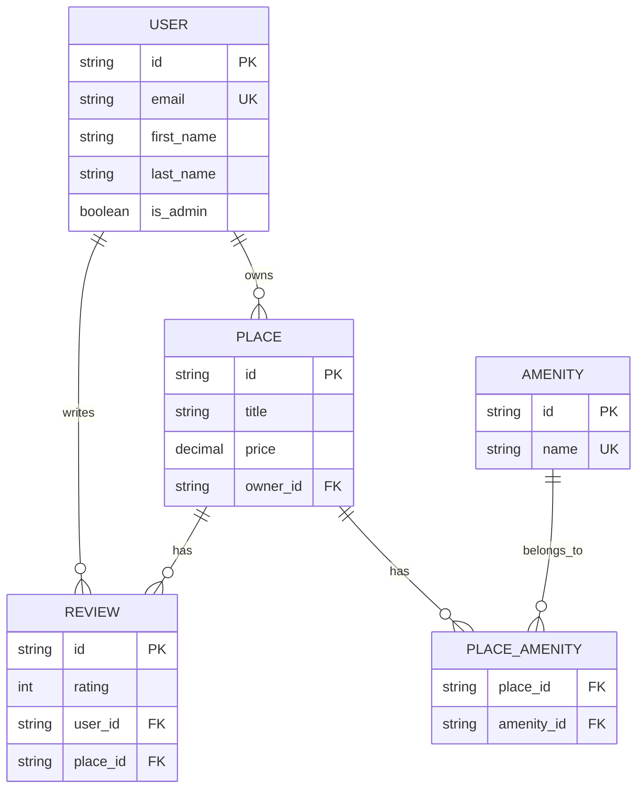

# Mermaid Syntax Test

## Test 1: Basic Entity Definition (Fixed)

## Test 2: Simple Relationship

## Test 3: Complex Relationships

## Syntax Validation

All diagrams above should now render correctly in:
- GitHub/GitLab markdown
- Mermaid Live Editor
- VS Code with Mermaid extension

The key fixes were:
1. Adding `erDiagram` declaration at the start of each diagram
2. Fixing entity name references to be consistent
3. Ensuring proper indentation and syntax
