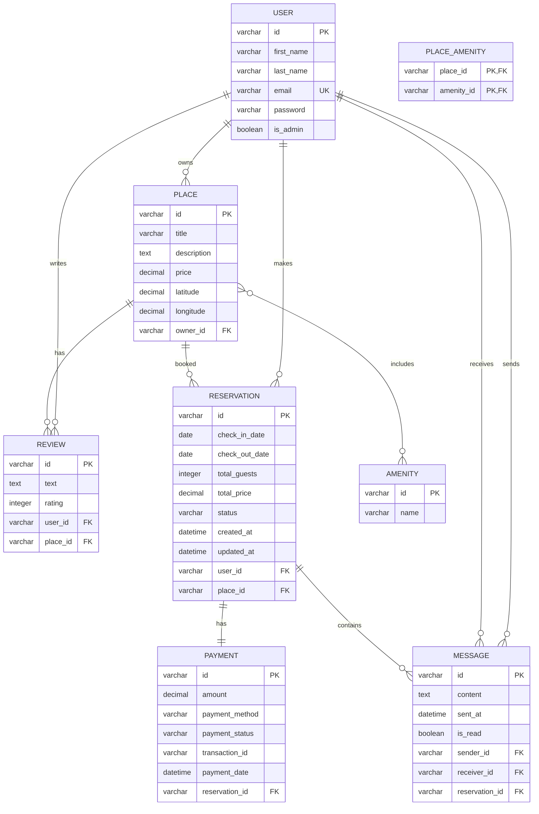

```mermaid
erDiagram
    USER ||--o{ PLACE : owns
    USER ||--o{ REVIEW : writes
    USER ||--o{ RESERVATION : makes
    USER ||--o{ MESSAGE : sends
    USER ||--o{ MESSAGE : receives
    PLACE ||--o{ REVIEW : has
    PLACE ||--o{ RESERVATION : booked
    PLACE }o--o{ AMENITY : includes
    RESERVATION ||--|| PAYMENT : has
    RESERVATION ||--o{ MESSAGE : contains

    USER {
        varchar id PK
        varchar first_name
        varchar last_name
        varchar email UK
        varchar password
        boolean is_admin
    }

    PLACE {
        varchar id PK
        varchar title
        text description
        decimal price
        decimal latitude
        decimal longitude
        varchar owner_id FK
    }

    REVIEW {
        varchar id PK
        text text
        integer rating
        varchar user_id FK
        varchar place_id FK
    }

    AMENITY {
        varchar id PK
        varchar name
    }

    PLACE_AMENITY {
        varchar place_id PK,FK
        varchar amenity_id PK,FK
    }

    RESERVATION {
        varchar id PK
        date check_in_date
        date check_out_date
        integer total_guests
        decimal total_price
        varchar status
        datetime created_at
        datetime updated_at
        varchar user_id FK
        varchar place_id FK
    }

    PAYMENT {
        varchar id PK
        decimal amount
        varchar payment_method
        varchar payment_status
        varchar transaction_id
        datetime payment_date
        varchar reservation_id FK
    }

    MESSAGE {
        varchar id PK
        text content
        datetime sent_at
        boolean is_read
        varchar sender_id FK
        varchar receiver_id FK
        varchar reservation_id FK
    }
```
