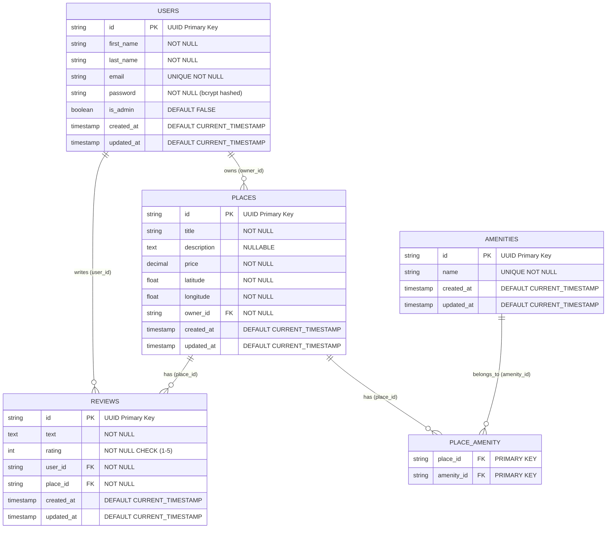
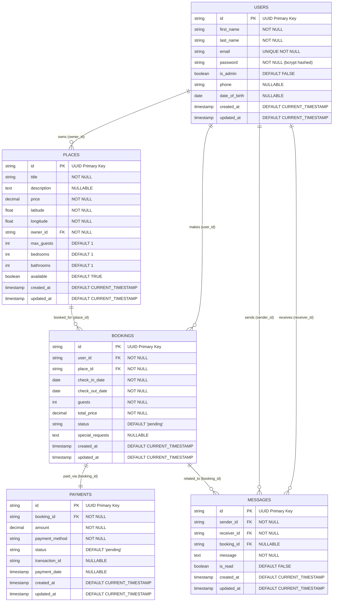
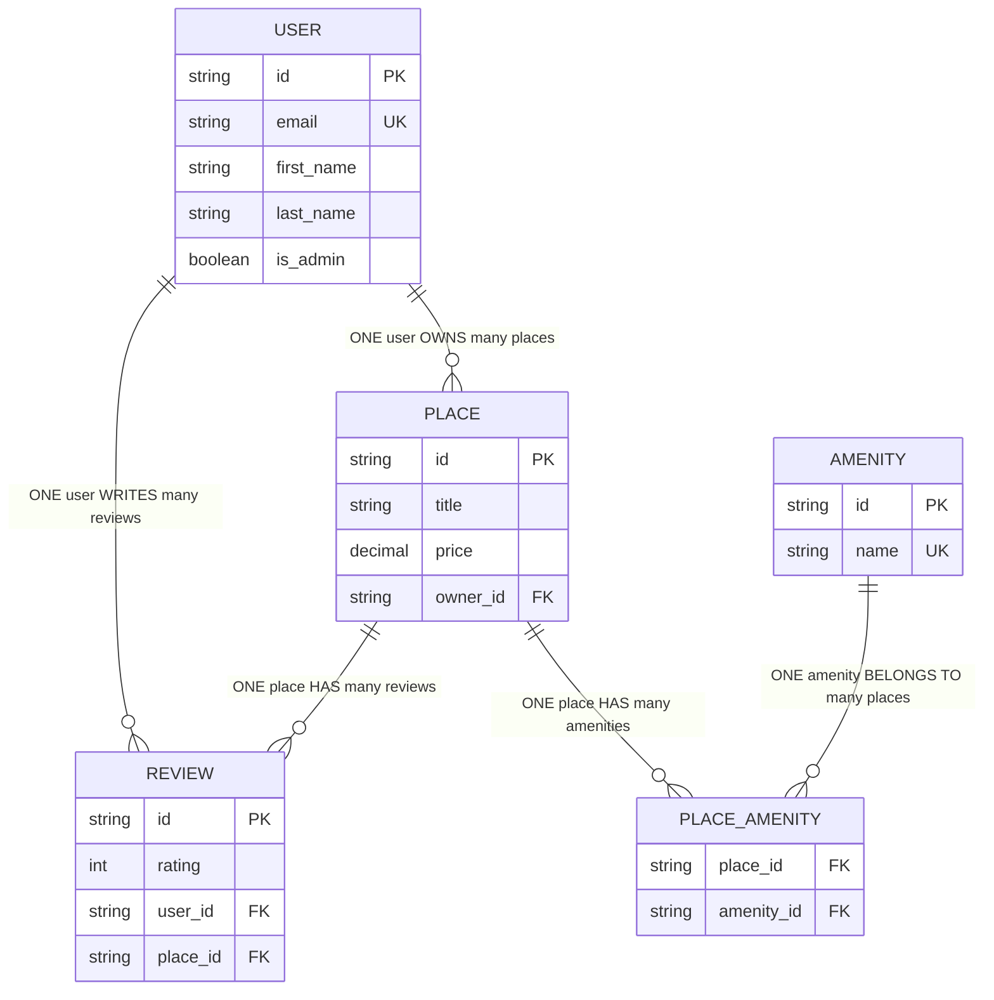

# HBnB Evolution - Part 4: Full-Stack Integration

## Author
- **Hector Soto**

## 📖 Overview

Part 4 of the HBnB Evolution project represents the complete full-stack implementation, integrating a production-ready Flask backend with a responsive frontend. This iteration combines advanced persistence capabilities, JWT authentication, comprehensive API endpoints, and a fully functional web interface.

## 🏗️ Architecture

### Project Structure
```
part4/
├── BackEnd/                    # Complete Flask API Backend
│   ├── app/
│   │   ├── __init__.py         # Flask app factory with extensions
│   │   ├── models/             # SQLAlchemy data models
│   │   │   ├── base_model.py   # Base model with common fields
│   │   │   ├── user.py         # User entity with auth
│   │   │   ├── place.py        # Place entity with relationships
│   │   │   ├── amenity.py      # Amenity entity
│   │   │   └── review.py       # Review entity with validation
│   │   ├── api/
│   │   │   └── v1/             # RESTful API endpoints
│   │   │       ├── auth.py     # JWT authentication
│   │   │       ├── users.py    # User management
│   │   │       ├── places.py   # Place management
│   │   │       ├── amenities.py# Amenity management
│   │   │       ├── reviews.py  # Review management
│   │   │       └── protected.py# Protected route examples
│   │   ├── services/           # Business logic layer
│   │   │   ├── facade.py       # Main business facade
│   │   │   └── repositories/   # Data access layer
│   │   └── persistence/        # Repository pattern implementation
│   ├── documentations/         # Comprehensive API documentation
│   ├── database_diagrams/      # ER diagrams and database design
│   ├── sql_scripts/           # Database setup and test scripts
│   ├── tests/                 # Comprehensive test suite
│   ├── config.py              # Multi-environment configuration
│   ├── run.py                 # Application entry point
│   ├── init_db.py             # Database initialization
│   ├── requirements.txt       # Python dependencies
│   └── README.md              # Backend documentation
├── FrontEnd/                   # Responsive Web Interface
│   ├── index.html              # Main page - List of Places
│   ├── place2.html             # Modern City Apartment details
│   ├── place3.html             # Beachfront Villa details
│   ├── place4.html             # Historic Downtown Loft details
│   ├── place5.html             # Countryside Cottage details
│   ├── place6.html             # Luxury Penthouse details
│   ├── login.html              # Login Form with JWT integration
│   ├── place.html              # Generic Place Details page
│   ├── add_review.html         # Add Review Form
│   ├── styles.css              # Responsive CSS styling
│   ├── scripts.js              # JavaScript functionality (login, API calls)
│   ├── config.js               # Frontend API configuration
│   ├── README.md               # Frontend documentation
│   └── images/                 # Image assets directory
│       ├── logo.png            # Application logo
│       ├── icon.png            # Favicon
│       ├── Cozy Mountain Cabin.png      # Property image
│       ├── Modern City Apartment.png   # Property image
│       ├── Beachfront Villa.png        # Property image
│       ├── Historic Downtown Loft.png  # Property image
│       ├── Countryside Cottage.png     # Property image
│       └── Luxury Penthouse.png        # Property image
├── LOGIN_README.md             # Login functionality documentation
└── README.md                   # This file
```

## Pages Implemented

### 1. Index Page (index.html)
- **Purpose**: Display a list of places as cards
- **Features**:
  - Responsive grid layout for place cards
  - Each card includes: name, price per night, "View Details" button
  - Uses semantic HTML5 structure with `<article>` for place cards
  - Required CSS classes: `place-card`, `details-button`

### 2. Login Page (login.html)
- **Purpose**: User authentication form
- **Features**:
  - Email and password input fields
  - Responsive form design
  - Form validation attributes (required, email type)
  - Uses semantic HTML5 form elements

### 3. Place Details Page (place.html)
- **Purpose**: Show detailed information about a specific place
- **Features**:
  - Place information with image, price, host, description
  - Amenities list
  - Reviews section with review cards
  - Add review functionality (shown when logged in)
  - Required CSS classes: `place-details`, `place-info`, `review-card`

### 4. Add Review Page (add_review.html)
- **Purpose**: Form for adding reviews (authenticated users only)
- **Features**:
  - Rating selection (1-5 stars)
  - Review text area
  - User name input
  - Form validation with JavaScript
  - Review guidelines section
  - Required CSS classes: `add-review`, `form`

## Design Specifications Met

### Required Structure Elements
- ✅ **Header**: Contains logo with class `logo` and login button with class `login-button`
- ✅ **Navigation Bar**: Links to index.html and login.html
- ✅ **Footer**: "All rights reserved" text
- ✅ **Main Content**: Uses semantic HTML5 `<main>` element

### Fixed Parameters Applied
- ✅ **Margin**: 20px for place and review cards
- ✅ **Padding**: 10px within place and review cards
- ✅ **Border**: 1px solid #ddd for place and review cards
- ✅ **Border Radius**: 10px for place and review cards

### CSS Classes Implemented
- ✅ `place-card` - Styling for place cards on index page
- ✅ `details-button` - Styling for "View Details" buttons
- ✅ `place-details` - Container for place detail information
- ✅ `place-info` - Place information layout
- ✅ `review-card` - Individual review styling
- ✅ `add-review` - Add review form container
- ✅ `form` - General form styling
- ✅ `login-button` - Header login/logout button
- ✅ `logo` - Application logo styling

## 🗄️ Database Architecture

### Core Database Schema

The HBnB application uses a well-designed relational database schema with proper relationships and constraints:



### Database Relationships

#### One-to-Many Relationships
1. **USERS → PLACES**: A user can own multiple places, but each place has exactly one owner
2. **USERS → REVIEWS**: A user can write multiple reviews, but each review is written by exactly one user
3. **PLACES → REVIEWS**: A place can have multiple reviews, but each review is for exactly one place

#### Many-to-Many Relationships
1. **PLACES ↔ AMENITIES**: A place can have multiple amenities, and an amenity can be available in multiple places (implemented via junction table `place_amenity`)

### Database Constraints
- **Primary Keys**: All tables use UUID format for primary keys
- **Foreign Keys**: All references include proper referential integrity
- **Unique Constraints**: 
  - `users.email` (unique email addresses)
  - `amenities.name` (unique amenity names)
  - `reviews(user_id, place_id)` (one review per user per place)
- **Check Constraints**: `reviews.rating` must be between 1 and 5
- **NOT NULL Constraints**: All required fields are enforced

### Extended Schema (Future Implementation)

For future enhancements, the database design includes support for a complete booking system:



### Relationship Types Visualization



## 🚀 Features

### Responsive Design
- Mobile-first approach with breakpoints at 768px and 480px
- Grid layouts adjust for different screen sizes
- Navigation collapses on smaller screens

### Accessibility
- Semantic HTML5 elements (`<header>`, `<nav>`, `<main>`, `<article>`, `<section>`)
- Proper form labels and ARIA attributes
- Alt text for images
- Keyboard navigation support

### Image Handling
- Placeholder images with SVG fallbacks using `onerror` attribute
- Responsive image sizing with `object-fit: cover`
- Proper alt text for accessibility

### JavaScript Enhancements
- **Login Functionality**: Complete AJAX-based login with JWT token management
- **Form Validation**: Client-side validation on add review page
- **Authentication State**: Cookie-based session management
- **Error Handling**: User-friendly error messages for login failures
- **API Integration**: Configurable endpoints for backend communication
- User feedback with alerts and confirmations

## Color Palette
- Primary: #2c3e50 (Dark blue-gray)
- Secondary: #3498db (Blue)
- Success: #27ae60 (Green)
- Warning: #f39c12 (Orange)
- Background: #f8f9fa (Light gray)
- Cards: #ffffff (White)

## Typography
- Font Family: Arial, sans-serif
- Headings: Bold, color #2c3e50
- Body Text: Regular, color #333
- Links: Color #3498db with hover effects

## Browser Compatibility
- HTML5 and CSS3 features used
- Compatible with modern browsers (Chrome, Firefox, Safari, Edge)
- Responsive design works on mobile devices

## W3C Validation
All HTML pages are designed to pass W3C validation:
- Proper DOCTYPE declaration
- Semantic HTML5 structure
- Valid attributes and nesting
- Proper form elements and labels

## Future Enhancements
- JavaScript for dynamic content loading
- User authentication integration
- Real image upload functionality
- Search and filtering capabilities
- Interactive map integration
- Booking system integration

## Usage

1. Navigate to the `FrontEnd/` directory
2. Open `index.html` in a web browser to view the main page
3. Navigate through the pages using the navigation menu
4. All forms are ready for backend integration
5. Replace placeholder images in the `FrontEnd/images/` directory with actual assets
6. Update API endpoints in `FrontEnd/config.js` for backend integration

## Login Functionality

✅ **Fully Implemented**: Complete login system with the following features:
- AJAX-based form submission using Fetch API
- JWT token storage in secure HTTP-only cookies
- Automatic redirection to main page on successful login
- Comprehensive error handling with user-friendly messages
- Configurable API endpoints via `config.js`
- Cookie utility functions for session management

For detailed login documentation, see `LOGIN_README.md`.

## Notes
- The logo and favicon are currently placeholder files
- **Login functionality is production-ready** and requires only API endpoint configuration
- Other form submissions point to placeholder endpoints (ready for backend integration)
- All CSS follows the specified fixed parameters
- Images include fallback SVG placeholders for better UX
- Directory structure now separates frontend and backend components
